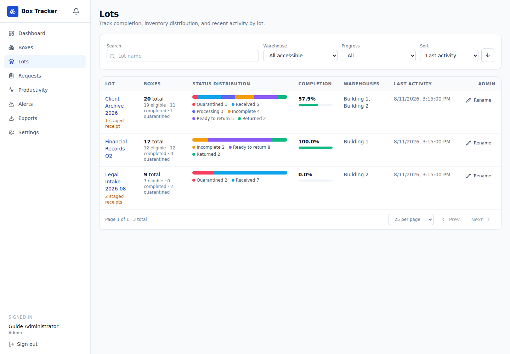
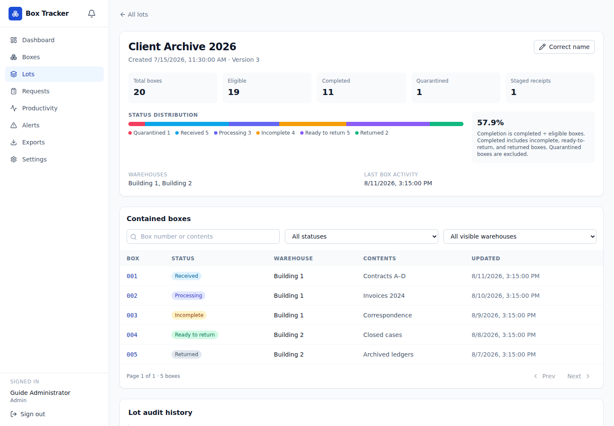

# Πλήρης οδηγός χρήσης — Warehouse Box Tracker

Έκδοση οδηγού: 20 Αυγούστου 2026

## 1. Σκοπός της εφαρμογής

Το Warehouse Box Tracker είναι εφαρμογή διαχείρισης φυσικών κιβωτίων, αιτημάτων
παράδοσης και επιστροφής, ειδοποιήσεων αποθέματος και παραγωγικότητας προσωπικού.
Η εφαρμογή διατηρεί ιστορικό ενεργειών, συνδέει τα κιβώτια με τα αιτήματα από τα
οποία προήλθαν και αποθηκεύει τα σχετικά παραστατικά ERP.

Η οργανωτική ιεραρχία είναι **Lot → Παλέτα → Κιβώτιο**, ενώ η φυσική αποθήκη
ανήκει στο Κιβώτιο. Το Lot εκφράζει την παρτίδα, η Παλέτα μια σταθερή ομάδα
κιβωτίων του ίδιου Lot και το Κιβώτιο τη μονάδα που έχει πραγματική θέση και
αλλάζει κατάσταση. Η ίδια Παλέτα μπορεί να περιλαμβάνει ταυτόχρονα κιβώτια σε
περισσότερες από μία αποθήκες. Η ανάθεση Παλέτας είναι προαιρετική: Κιβώτιο
χωρίς ανάθεση εμφανίζεται ως **Unassigned**, χωρίς να δημιουργείται εικονική
Παλέτα. Το πεδίο περιγραφής
ειδών (**Item descriptions/Contents**) είναι ένα ενιαίο, προαιρετικό κείμενο
του Κιβωτίου έως 2.000 χαρακτήρες· δεν δημιουργεί ξεχωριστές εγγραφές ειδών,
ποσότητες ή δεύτερο επίπεδο αποθέματος.

Ο οδηγός απευθύνεται σε:

- απλούς χρήστες που παρακολουθούν το απόθεμα,
- χειριστές που παραλαμβάνουν, επεξεργάζονται ή μετακινούν κιβώτια,
- μεταφορείς αποθήκης που εγκρίνουν και εκτελούν αιτήματα,
- διαχειριστές που ρυθμίζουν αποθήκες, χρήστες και εργαζομένους.

> Οι ονομασίες των κουμπιών και των πεδίων εμφανίζονται όπως είναι σήμερα στο
> αγγλικό περιβάλλον της εφαρμογής. Τα δεδομένα των εικόνων είναι ενδεικτικά και
> δεν προέρχονται από παραγωγικό σύστημα.

## 2. Ρόλοι και δικαιώματα

| Ρόλος | Προβολή | Κιβώτια | Αιτήματα | Παραγωγικότητα | Ρυθμίσεις |
| --- | --- | --- | --- | --- | --- |
| **Viewer** | Ναι | Μόνο ανάγνωση | Δημιουργία και προβολή δικών του/επιτρεπόμενων αιτημάτων | Προβολή | Όχι |
| **Operator** | Ναι | Δημιουργία, επεξεργασία, μετακίνηση και αλλαγή κατάστασης | Δημιουργία και παραλαβή εισερχόμενου αιτήματος όταν είναι ο αιτών | Καταχώριση ημερήσιων στοιχείων | Όχι |
| **Warehouse Mover** | Ναι | Μόνο ανάγνωση | Έγκριση/απόρριψη, προετοιμασία, παραστατικά ERP, μεταφορά, άφιξη, εξαιρέσεις και επιβεβαίωση επιστροφής | Προβολή | Όχι |
| **Admin** | Ναι | Πλήρης διαχείριση, ελεγχόμενες παρακάμψεις και ασφαλής μόνιμη εκκαθάριση lot | Πλήρης διαχείριση | Πλήρης διαχείριση | Ναι |

Για κάθε μη διαχειριστικό ρόλο ισχύουν επιπλέον οι αναθέσεις αποθηκών. Αν ένας
χρήστης δεν έχει πρόσβαση σε μια αποθήκη, δεν βλέπει ούτε μπορεί να μεταβάλει τα
δεδομένα της.

## 3. Σύνδεση και αποσύνδεση

### 3.1 Σύνδεση με Microsoft 365

1. Ανοίξτε τη διεύθυνση της εφαρμογής.
2. Επιλέξτε **Microsoft 365**.
3. Πατήστε **Sign in with Microsoft**.
4. Επιλέξτε τον εταιρικό λογαριασμό σας.
5. Μετά την επιτυχή σύνδεση θα μεταφερθείτε στο **Dashboard**.

Ο ρόλος σας προέρχεται από το Microsoft Entra ID. Αν η σύνδεση ολοκληρωθεί αλλά
η εφαρμογή εμφανίσει μήνυμα απαγόρευσης, ζητήστε από διαχειριστή να ελέγξει:

- την ανάθεση App Role,
- την τοπική ενεργοποίηση του χρήστη,
- τις αναθέσεις αποθηκών.

### 3.2 Τοπικός λογαριασμός έκτακτης ανάγκης

Ο λογαριασμός **Local admin** χρησιμοποιείται μόνο όταν το Microsoft 365 δεν
είναι διαθέσιμο ή δεν έχει ακόμη ρυθμιστεί.

1. Επιλέξτε **Local admin**.
2. Συμπληρώστε **Username** και **Password**.
3. Πατήστε **Sign in**.
4. Στην πρώτη σύνδεση, ορίστε υποχρεωτικά νέο όνομα χρήστη και νέο κωδικό.
   Ο νέος κωδικός πρέπει να έχει τουλάχιστον 12 χαρακτήρες, να διαφέρει από
   τον αρχικό και να συμφωνεί με το πεδίο επιβεβαίωσης.

### 3.3 Αποσύνδεση

Σε υπολογιστή, πατήστε **Sign out** στο κάτω μέρος της αριστερής στήλης. Σε
κινητό, ανοίξτε το μενού χρήστη και επιλέξτε **Sign out**.

## 4. Πλοήγηση

Το κύριο μενού περιλαμβάνει:

- **Dashboard** — συνοπτική εικόνα αποθηκών,
- **Lots** — λίστα παρτίδων, πρόοδος και αναλυτική κατανομή,
- **Pallets** — παλέτες, πρόοδος, κιβώτια και ιστορικό,
- **Boxes** — αναζήτηση και διαχείριση κιβωτίων,
- **Requests** — αιτήματα εισαγωγής και επιστροφής,
- **Productivity** — ημερήσια παραγωγικότητα και μέσοι όροι,
- **Alerts** — ενεργές και ιστορικές ειδοποιήσεις,
- **Exports** — εξαγωγές CSV/XLSX,
- **Settings** — ρυθμίσεις διαχειριστή.

Ο κόκκινος αριθμός δίπλα στο **Alerts** δείχνει πόσες ανοικτές ειδοποιήσεις
υπάρχουν. Η ροζ λωρίδα στο επάνω μέρος οδηγεί επίσης στις ειδοποιήσεις.
Όταν υπάρχει σύνδεση δικτύου, οι βασικές λίστες και το Dashboard ανανεώνονται
αυτόματα μέσω live stream χωρίς χειροκίνητο refresh.

Σε κινητό:

- η βασική πλοήγηση εμφανίζεται στο κάτω μέρος,
- το μενού χρήστη ανοίγει από το επάνω κουμπί,
- οι πίνακες εμφανίζονται ως κάρτες ή οριζόντια κυλιόμενες λίστες.

## 5. Dashboard

Το **Dashboard** εμφανίζει μόνο ενεργές και προσβάσιμες αποθήκες.

Κάθε κάρτα αποθήκης δείχνει:

- **Available**: κιβώτια σε κατάσταση `Received` ή `Processing`,
- **Unavailable**: κιβώτια σε κατάσταση `Incomplete` ή `Ready to Return`,
- σύγκριση διαθέσιμων κιβωτίων με το **Min inventory**,
- σύγκριση μη διαθέσιμων κιβωτίων με το **Max capacity**,
- ολοκληρώσεις, παραλαβές και επιστροφές της ημέρας,
- κιβώτια συσκευασμένα για επιστροφή,
- ημερήσια και εβδομαδιαία παραγωγικότητα,
- ανοικτές ειδοποιήσεις.

Πατήστε μια κάρτα αποθήκης για να ανοίξετε τη λίστα κιβωτίων φιλτραρισμένη στη
συγκεκριμένη αποθήκη. Πατήστε **View** στο τμήμα παραγωγικότητας για περισσότερα
στοιχεία.

## 6. Διαχείριση κιβωτίων

### 6.1 Καταστάσεις κιβωτίου

Η κανονική ακολουθία είναι:

1. **Received** — το κιβώτιο βρίσκεται στην αποθήκη και δεν έχει ανοιχτεί.
2. **Processing** — έχει ξεκινήσει η επεξεργασία.
3. **Incomplete** — η επεξεργασία έκλεισε χωρίς το κιβώτιο να είναι ακόμη
   έτοιμο για επιστροφή.
4. **Ready to Return** — το κιβώτιο είναι συσκευασμένο και διαθέσιμο για
   αίτημα επιστροφής.
5. **Returned** — το κιβώτιο παραδόθηκε πίσω και δεν αποτελεί ενεργό απόθεμα.

Ο Operator και ο Admin μπορούν να προχωρούν ένα βήμα τη φορά. Ο Admin μπορεί να
ενεργοποιήσει **Override rules (admin)** για έκτακτη αλλαγή κατάστασης ή
μετακίνηση. Απαιτείται αιτιολογία και η ενέργεια καταγράφεται ως διαχειριστική
παράκαμψη.

### 6.2 Λίστα και αναζήτηση

Στη σελίδα **Boxes** μπορείτε να:

- αναζητήσετε με αριθμό κιβωτίου, lot, παλέτα ή περιγραφή ειδών,
- φιλτράρετε ανά αποθήκη, κατάσταση, lot και παλέτα,
- επιλέξετε **Unassigned** για οποιοδήποτε κιβώτιο χωρίς παλέτα,
- ταξινομήσετε πατώντας τις επικεφαλίδες των στηλών,
- αλλάξετε το πλήθος αποτελεσμάτων ανά σελίδα,
- επιλέξετε πολλά κιβώτια για μαζική ενέργεια.

Η ταξινόμηση μιας στήλης λειτουργεί κυκλικά:

1. φθίνουσα,
2. αύξουσα,
3. επιστροφή στην προεπιλεγμένη ταξινόμηση.

### 6.3 Χειροκίνητη παραλαβή νέου κιβωτίου

1. Μεταβείτε στο **Boxes**.
2. Πατήστε **Receive new box**.
3. Επιλέξτε ενεργή αποθήκη.
4. Συμπληρώστε:
   - **Box number**,
   - **Lot**,
   - προαιρετικά **Pallet** (επιλογή υπάρχουσας, δημιουργία νέας ή **Leave
     Unassigned**),
   - προαιρετικά **Item descriptions/Contents** έως 2.000 χαρακτήρες.
5. Πατήστε **Receive box**.

Ο αριθμός κανονικοποιείται σε τρία ψηφία όταν είναι αριθμητικός. Η μοναδικότητα
ελέγχεται ανά συνδυασμό lot και αριθμού κιβωτίου.

Η χειροκίνητη παραλαβή δημιουργεί αυτόματα ολοκληρωμένη εισερχόμενη απόδειξη
τύπου **Manual receipt**, ώστε το κιβώτιο να μπορεί αργότερα να συμμετάσχει στην
ίδια ροή επιστροφής με τα κιβώτια κανονικού αιτήματος.

### 6.4 Εισαγωγή κιβωτίων από XLSX

1. Πατήστε **Import XLSX**.
2. Επιλέξτε **Destination warehouse**.
3. Επιλέξτε αρχείο `.xlsx`.
4. Πατήστε **Preview workbook**.
5. Επιλέξτε φύλλο εργασίας, αν υπάρχουν περισσότερα από ένα.
6. Αντιστοιχίστε τις στήλες του αρχείου με:
   - αριθμό κιβωτίου,
   - lot από στήλη ή μία σταθερή τιμή lot για όλες τις γραμμές,
   - προαιρετικά παλέτα από στήλη ή επιλέξτε ρητά **Leave new boxes
     Unassigned**,
   - προαιρετική περιγραφή ειδών.
7. Όλες οι γραμμές περιλαμβάνονται αρχικά. Αποεπιλέξτε επικεφαλίδες, σύνολα ή
   άλλες άσχετες γραμμές.
8. Ελέγξτε τον αριθμό έγκυρων κιβωτίων.
9. Πατήστε **Import boxes**.

Σημαντικοί κανόνες:

- Κενές ή μη έγκυρες γραμμές παραλείπονται και εμφανίζονται στην αναφορά.
- Κενό κελί σε επιλεγμένη στήλη Παλέτας σημαίνει **Unassigned** και δεν
  αφαιρεί τη γραμμή. Δεν αποθηκεύεται η λέξη `Unassigned` ως αριθμός Παλέτας.
- Πολλαπλές γραμμές με ίδιο lot και ίδιο box number συγχωνεύονται σε ένα
  φυσικό κιβώτιο όταν είναι όλες Unassigned ή συμφωνεί η κανονικοποιημένη
  Παλέτα. Ανάθεση έναντι Unassigned ή δύο διαφορετικές αναθέσεις για το ίδιο
  φυσικό κιβώτιο είναι σύγκρουση και η εισαγωγή σταματά.
- Διαφορετικές τιμές περιεχομένων συνδυάζονται.
- Το συνολικό κείμενο περιγραφής ειδών δεν μπορεί να υπερβεί τους 2.000
  χαρακτήρες.
- Η εισαγωγή δημιουργεί αυτόματα ολοκληρωμένο **Imported receipt**.
- Η τελική σύνοψη ξεχωρίζει πόσα κιβώτια είναι assigned και πόσα Unassigned.

#### Επαναφορά κατά λάθος αρχειοθετημένων κιβωτίων

Αν ένα κιβώτιο με ίδιο lot και box number υπάρχει αρχειοθετημένο:

1. ενεργοποιήστε **Restore matching archived boxes**,
2. εκτελέστε την εισαγωγή,
3. η εφαρμογή επαναφέρει την υπάρχουσα εγγραφή αντί να δημιουργήσει νέα,
4. διατηρείται ολόκληρο το ιστορικό και προστίθεται νέο συμβάν επαναφοράς.

Αν δεν δώσετε Παλέτα, διατηρείται η υπάρχουσα έγκυρη Παλέτα του ίδιου Lot·
αρχειοθετημένο κιβώτιο που ήταν Unassigned παραμένει Unassigned. Ρητή επιλογή
Παλέτας κάνει επαναανάθεση. Υπάρχουσα μη έγκυρη, ανενεργή ή άλλου Lot ανάθεση
μπλοκάρει την επαναφορά αντί να διορθωθεί σιωπηρά.

Χρησιμοποιείτε αυτή την επιλογή μόνο όταν επιβεβαιώσετε ότι πρόκειται για το
ίδιο φυσικό κιβώτιο.

### 6.5 Μαζικές ενέργειες

1. Επιλέξτε τα πλαίσια δίπλα στα κιβώτια.
2. Χρησιμοποιήστε τη γραμμή μαζικών ενεργειών για:
   - αλλαγή κατάστασης,
   - μετακίνηση σε άλλη ενεργή αποθήκη,
   - διαγραφή/αρχειοθέτηση.
3. Ελέγξτε το αποτέλεσμα:
   - **updated/deleted** για επιτυχείς εγγραφές,
   - **skipped** για εγγραφές που προστατεύθηκαν από κανόνα.

Οι διαχειριστικές παρακάμψεις απαιτούν αιτιολογία. Αν κιβώτιο δεσμεύεται από
ενεργό αίτημα επιστροφής, μια εξαναγκασμένη μετακίνηση ή αρχειοθέτηση ακυρώνει
το επηρεαζόμενο αίτημα και δημιουργεί συμβάν ελέγχου.

Για μαζική διόρθωση θέσης κιβωτίων **Returned**, απαιτούνται ρόλος Admin,
ενεργοποίηση **Override rules (admin)**, ενεργή αποθήκη προορισμού και
αιτιολογία. Τα κιβώτια παραμένουν `Returned`, διατηρούν το `returned_at` και το
αποτέλεσμα εμφανίζει ακριβώς ποια ενεργά αιτήματα επιστροφής ακυρώθηκαν.

### 6.6 Λεπτομέρειες και ιστορικό κιβωτίου

Πατήστε τον αριθμό ενός κιβωτίου για να δείτε:

- lot, περιεχόμενα και τρέχουσα αποθήκη,
- ημερομηνίες παραλαβής και επιστροφής,
- επόμενη επιτρεπόμενη κατάσταση,
- επιλογή μετακίνησης,
- πλήρες **Activity** με δημιουργία, αλλαγές, μετακινήσεις, επιστροφή,
  αρχειοθέτηση και επαναφορά.

Σε κιβώτιο **Returned**, ο Admin βλέπει ξεχωριστή ενότητα **Relocate returned
box**. Επιλέγει διαφορετική ενεργή αποθήκη και γράφει υποχρεωτική αιτιολογία.
Η ενέργεια διορθώνει μόνο τη φυσική θέση: δεν ανοίγει ξανά το κιβώτιο, δεν
αλλάζει την ημερομηνία επιστροφής και καταγράφει source/target, χρήστη,
αιτιολογία και IDs τυχόν ακυρωμένων δεσμεύσεων επιστροφής.

### 6.7 Διαγραφή και αρχειοθέτηση κιβωτίου

Στο **Danger zone**:

- μη συνδεδεμένο κιβώτιο μπορεί να διαγραφεί μόνιμα μαζί με το ιστορικό του,
- κιβώτιο που αναφέρεται σε αίτημα δεν διαγράφεται μόνιμα,
- ο Admin μπορεί να το αρχειοθετήσει με υποχρεωτική αιτιολογία,
- αρχειοθετημένο κιβώτιο κρύβεται από το ενεργό απόθεμα αλλά διατηρεί όλα τα
  συμβάντα και τις συνδέσεις αιτημάτων.

### 6.8 Lots: ταυτότητα, λίστα και λεπτομέρειες

Το lot είναι πλέον μόνιμη οντότητα και όχι ανεξάρτητο κείμενο σε κάθε κιβώτιο.
Η ταυτότητα είναι **καθολική και δεν διακρίνει πεζά/κεφαλαία**: αφαιρούνται τα
κενά στην αρχή/στο τέλος και κάθε ακολουθία κενών γίνεται ένα κενό. Επομένως τα
`LOT A`, `lot a` και ` Lot   A ` είναι το ίδιο lot. Το εμφανιζόμενο όνομα είναι
μία κοινή, ελεγχόμενη ονομασία για όλα τα συνδεδεμένα κιβώτια.

Από το **Lots** μπορείτε να:

- αναζητήσετε με όνομα,
- φιλτράρετε ανά προσβάσιμη αποθήκη και πρόοδο,
- ταξινομήσετε ανά όνομα, ολοκλήρωση, πλήθος κιβωτίων ή τελευταία δραστηριότητα,
- δείτε την κατανομή `Quarantined`, `Received`, `Processing`, `Incomplete`,
  `Ready to Return` και `Returned`,
- ανοίξετε το lot και από σύνδεσμο σε λίστα/λεπτομέρεια κιβωτίου ή αιτήματος,
- δείτε και να εξαγάγετε staged receipts που ακόμη περιμένουν έλεγχο.

Η ολοκλήρωση υπολογίζεται ως:

`(Incomplete + Ready to Return + Returned) / όλα τα μη Quarantined κιβώτια`

Τα `Received` και `Processing` συμμετέχουν στον παρονομαστή αλλά όχι στον
αριθμητή. Τα `Quarantined` εξαιρούνται και από τα δύο. Αρχειοθετημένα κιβώτια
δεν συμμετέχουν στα τρέχοντα metrics. Αν δεν υπάρχει κανένα επιλέξιμο κιβώτιο,
εμφανίζεται **No eligible boxes** και όχι παραπλανητικό `0%`.

Η λεπτομέρεια εμφανίζει τα ίδια metrics, τις ορατές αποθήκες, την τελευταία
δραστηριότητα και φιλτραρισμένη λίστα κιβωτίων. Για μη Admin, όλα τα πλήθη,
ποσοστά, αποθήκες, staged receipts, λεπτομέρειες και exports υπολογίζονται μόνο
μέσα στις αναθέσεις αποθηκών του χρήστη. Η ένδειξη **Accessible warehouses
only** υπενθυμίζει ότι δεν πρόκειται για οργανωτικό σύνολο.

### 6.9 Δημιουργία, επιλογή και διόρθωση lot

Στη χειροκίνητη παραλαβή και στις οθόνες που ζητούν lot:

1. πληκτρολογήστε μέρος του ονόματος,
2. επιλέξτε υπάρχον αποτέλεσμα από το picker,
3. αν δεν υπάρχει ακριβής κανονικοποιημένη αντιστοίχιση και έχετε δικαίωμα
   παραλαβής, επιλέξτε **Create new lot**,
4. επιβεβαιώστε ότι πρόκειται για πραγματικά νέα παρτίδα και όχι διαφορετική
   γραφή υπάρχουσας.

Στο Excel mapping μπορείτε είτε να αντιστοιχίσετε στήλη lot είτε να ορίσετε ένα
**fixed lot** για όλες τις επιλεγμένες γραμμές. Και οι δύο τρόποι εφαρμόζουν την
ίδια καθολική ταυτότητα και δεν δημιουργούν δεύτερο lot λόγω πεζών/κεφαλαίων ή
περιττών κενών. Οι επαναλαμβανόμενες γραμμές ίδιου lot και box number
συγχωνεύονται ή απορρίπτονται σύμφωνα με τη συγκεκριμένη ροή, όπως πριν.

Υπάρχουν τρεις διαφορετικές διορθώσεις, μόνο για Admin:

- **Correct/Rename lot** αλλάζει καθολικά το εμφανιζόμενο όνομα του ίδιου lot.
  Δεν μετακινεί κιβώτια και δεν αλλάζει ιστορικά snapshots αιτημάτων.
- Αν το νέο όνομα αντιστοιχεί σε υπάρχον lot, η εφαρμογή **δεν συγχωνεύει
  αυτόματα**. Εμφανίζει το υπάρχον όνομα και ζητά ξεχωριστή, ρητή επιβεβαίωση
  **Merge** με την ίδια υποχρεωτική αιτιολογία. Χωρίς κοινό φυσικό `box number`
  εμφανίζεται η κανονική επιβεβαίωση συγχώνευσης. Αν κάθε κοινός αριθμός έχει
  τουλάχιστον ένα αρχειοθετημένο κιβώτιο, εμφανίζεται ξεχωριστή επιβεβαίωση
  **Archived box overwrite**: το ενεργό κιβώτιο διατηρείται πάντοτε· αν και τα
  δύο είναι αρχειοθετημένα, διατηρείται το κιβώτιο του lot στόχου. Ο Admin πρέπει
  να επιλέξει ρητά το checkbox αφού ελέγξει ξανά όλη την προεπισκόπηση.
  Οποιαδήποτε επικάλυψη ενεργού με ενεργό κιβώτιο μπλοκάρει οριστικά τη
  συγχώνευση, ακόμη και αν σταλεί τεχνικά η παράμετρος overwrite.
- **Reassign box to lot** μετακινεί μόνο ένα συγκεκριμένο φυσικό κιβώτιο σε
  άλλο υπάρχον lot. Δεν μετονομάζει, συγχωνεύει ή διαγράφει lots.

Κάθε ενέργεια απαιτεί υποχρεωτικό λόγο και την τρέχουσα έκδοση. Αν το
lot άλλαξε ενδιάμεσα, εμφανίζεται σύγκρουση και πρέπει να φορτωθεί η νεότερη
έκδοση και να δοθεί ξανά ρητή επιβεβαίωση. Με επιτυχημένο Merge, όλα τα φυσικά
κιβώτια και οι τρέχουσες συνδέσεις lot των αιτημάτων μετακινούνται στο lot
στόχο. Τα ιστορικά κείμενα lot στα αιτήματα και τα αποθηκευμένα `fixed lot` των
XLSX mappings δεν αλλάζουν. Το lot πηγής διατηρεί το παλιό εμφανιζόμενο όνομα
ως κρυφό audit tombstone και η παλιά ονομασία μπορεί αργότερα να χρησιμοποιηθεί
για πραγματικά νέο lot· δεν εμφανίζεται πλέον σε λίστες ή pickers και παλιός
σύνδεσμος οδηγεί με ασφάλεια στο lot στόχο.

Στο ρητά επιβεβαιωμένο **Archived box overwrite**, το αρχειοθετημένο κιβώτιο που
δεν επιβιώνει και μόνο τα δικά του Box events διαγράφονται μόνιμα. Οι συνδέσεις
`BoxRequestItem.box_id` και `BoxRequestDiscrepancy.box_id` από αυτό το κιβώτιο
μεταφέρονται στο κιβώτιο που επιβιώνει για self-receipts, μικτά receipts,
ενεργές ή ολοκληρωμένες επιστροφές και follow-ups. Το `BoxRequestItem.lot_id`
της πηγής μεταφέρεται στο lot στόχο, αλλά το αμετάβλητο ιστορικό κείμενο
`BoxRequestItem.lot` και το ιστορικό box number παραμένουν όπως καταγράφηκαν.
Αιτήματα, discrepancies και φωτογραφίες, documents/attachments, notifications,
object keys, purge ledgers και άσχετα lots ή κιβώτια δεν διαγράφονται. Το μόνιμο
Lot audit κρατά IDs, πλήθη και μη ευαίσθητα snapshots των Box events που
αφαιρέθηκαν. Το αποτέλεσμα API και το SSE δίνουν τα αντίστοιχα πλήθη χωρίς να
μεταφέρουν την αιτιολογία στο live payload.

Επανατοποθέτηση που θα δημιουργούσε διπλό `(lot, box number)` απορρίπτεται. Το
audit κρατά παλιό/νέο
όνομα ή source/target lot, κιβώτιο, χρήστη, ώρα, λόγο και έκδοση. Τα snapshots
στα ήδη καταχωρισμένα αιτήματα παραμένουν αμετάβλητα.

### 6.10 Μόνιμη εκκαθάριση λανθασμένου lot και self-receipt

Η **Purge lot** είναι ενέργεια μόνο για **Admin** και βρίσκεται στο **Danger
zone** της ενεργής λεπτομέρειας lot. Προορίζεται αποκλειστικά για διόρθωση
λανθασμένης χειροκίνητης ή XLSX αυτοπαραλαβής. Δεν είναι γενικός τρόπος
διαγραφής ιστορικού και **δεν αναιρείται**. Η εφαρμογή δοκιμάζει πάντοτε πρώτα
την ασφαλή εκκαθάριση· η ξεχωριστή διαχειριστική force ανάκτηση εμφανίζεται
μόνο όταν η ασφαλής διαδρομή μπλοκάρεται.

Πριν εμφανιστεί επιβεβαίωση, η εφαρμογή φορτώνει νέα προεπισκόπηση από τον
server. Η μόνιμη εκκαθάριση επιτρέπεται μόνο όταν ισχύουν όλα τα παρακάτω:

- το lot είναι ενεργό, δεν είναι συγχωνευμένη πηγή ή στόχος tombstone και δεν
  έχει ιστορικό merge,
- όλα τα φυσικά κιβώτιά του είναι αρχειοθετημένα,
- κάθε αρχειοθετημένο κιβώτιο συνδέεται με συγκεκριμένη γραμμή ολοκληρωμένου
  self-receipt,
- κάθε συνδεδεμένο αίτημα είναι ολοκληρωμένο εισερχόμενο self-receipt με origin
  `manual_entry` ή `xlsx_import`,
- κάθε τέτοιο receipt περιέχει αποκλειστικά το συγκεκριμένο lot και
  συγκεκριμένα φυσικά κιβώτια,
- δεν υπάρχει μεταγενέστερη ροή ή ιστορικό: staged/open/non-completed request,
  return, follow-up/backorder, parent/child/root/source lineage, άλλο workflow
  event, μετακίνηση/επιστροφή/επαναφορά κιβωτίου ή επανατοποθέτηση lot,
- κανένα ξένο request/item και κανένα άλλο request δεν αναφέρεται στο ίδιο
  αποθηκευμένο object key.

Πολλαπλά ολοκληρωμένα self-receipts του ίδιου lot επιτρέπονται, εφόσον **όλα**
είναι αποκλειστικά, όλα τα κιβώτια είναι αρχειοθετημένα και δεν υπάρχει
μεταγενέστερο ιστορικό. Αν ένα receipt περιέχει έστω και μία γραμμή άλλου lot,
η εκκαθάριση μπλοκάρεται ώστε να μη διαγραφούν sibling δεδομένα.

Η προεπισκόπηση εμφανίζει:

- τρέχον όνομα και έκδοση lot,
- πλήθος και IDs ενεργών/αρχειοθετημένων κιβωτίων,
- IDs, origin, status, direction και πλήθη γραμμών των receipts,
- πλήθος αρχείων/object keys που θα καθαριστούν,
- αναλυτικά blockers με συνδέσμους στα σχετικά lot, box, request ή audit events.

Για την τελική ενέργεια ο Admin πρέπει να γράψει:

1. το τρέχον εμφανιζόμενο όνομα του lot **ακριβώς** όπως δίνεται — με διάκριση
   πεζών/κεφαλαίων και χωρίς αυτόματο trim, σύμπτυξη κενών ή άλλη
   κανονικοποίηση,
2. υποχρεωτική αιτιολογία έως 2.000 χαρακτήρες.

Η τρέχουσα έκδοση και η πλήρης υπογραφή της προεπισκόπησης ελέγχονται ξανά κάτω
από κλειδώματα βάσης. Αν το lot ή οποιαδήποτε σχέση αλλάξει, η επιβεβαίωση
ακυρώνεται, φορτώνεται νέα προεπισκόπηση και το ακριβές όνομα πρέπει να γραφτεί
ξανά.

Με την επιτυχία διαγράφονται μόνιμα, στην ίδια συναλλαγή PostgreSQL:

- το lot και τα Lot events του,
- όλα τα αρχειοθετημένα κιβώτια και τα Box events τους,
- τα αποκλειστικά receipts και όλες οι δικές τους εγγραφές: items, request
  events, ERP documents, attachments, comments, discrepancies και φωτογραφίες,
  operational exceptions, in-app notifications και email outbox.

Τα δεδομένα δεν επανέρχονται. Διατηρείται μόνο ανεξάρτητο purge audit με
snapshot ταυτότητας/έκδοσης, Admin, αιτιολογία, IDs και πλήθη διαγραμμένων
εγγραφών και κατάσταση καθαρισμού αρχείων. Το audit και η διαγραφή της βάσης
γίνονται ατομικά: οποιοδήποτε σφάλμα στη διαγραφή της βάσης αναιρεί ολόκληρη τη
συναλλαγή.

Τα ιδιωτικά αρχεία διαγράφονται από το RustFS **μετά** το commit της βάσης. Αν
το RustFS αποτύχει ή ένα key εξακολουθεί να χρησιμοποιείται αλλού, η εφαρμογή
δεν δηλώνει πλήρη επιτυχία καθαρισμού: εμφανίζει `pending`, `failed` ή
`partial failure`, κρατά ανθεκτικά τις αποτυχίες στο purge audit και επιτρέπει
σε Admin να πατήσει **Retry storage cleanup**. Η επανάληψη είναι idempotent και
δεν ξαναδιαγράφει δεδομένα από τη βάση.

#### Διαχειριστική force εκκαθάριση

Αν η ασφαλής εκκαθάριση μπλοκάρεται, ο Admin μπορεί να ανοίξει ξεχωριστή
προεπισκόπηση **Administrative force purge**. Η force λειτουργία αφορά
**αποκλειστικά το επιλεγμένο lot**: διαγράφει το lot, τα δικά του ενεργά ή
αρχειοθετημένα κιβώτια και μόνο τις αντίστοιχες γραμμές/διαφορές αιτημάτων. Δεν
ακολουθεί το συνδεδεμένο γράφημα για να διαγράψει sibling lots, sibling boxes,
άσχετες discrepancies, documents, notifications ή άλλα δεδομένα που πρέπει να
διατηρηθούν.

Σε μικτό αίτημα οι υπόλοιπες γραμμές επαναριθμούνται χωρίς σύγκρουση μοναδικής
θέσης. Το status και τα timestamps της ροής διατηρούνται, τα
quantity/actual/variance επανυπολογίζονται σύμφωνα με τις γραμμές που
παραμένουν, η έκδοση αυξάνεται και γράφεται ειδικό συμβάν
`force_purge_adjusted` με πριν/μετά και IDs. Αν ένα αίτημα μείνει χωρίς γραμμές,
διαγράφεται μαζί με ολόκληρο το FK-owned γράφημά του. Συνδέσεις
source/parent/root από διατηρούμενα αιτήματα αποσυνδέονται και καταγράφονται.

Η force ενέργεια παραμένει αυστηρά μπλοκαρισμένη όταν το lot είναι πηγή ή
στόχος συγχώνευσης. Όταν επιτρέπεται, απαιτούνται ανεξάρτητα:

1. το ακριβές τρέχον όνομα lot,
2. η ακριβής φράση server `FORCE DELETE LOT <id>`,
3. τεκμηριωμένη αιτιολογία τουλάχιστον 20 χαρακτήρων,
4. ξεχωριστή επιλογή για κάθε safeguard που παρακάμπτεται.

Η έκδοση, η υπογραφή ολόκληρου του γραφήματος και όλες οι αναγνωρίσεις
ελέγχονται ξανά κάτω από κλειδώματα PostgreSQL. Αν κάτι αλλάξει, οι
επιβεβαιώσεις μηδενίζονται και πρέπει να δοθούν ξανά. Το ανεξάρτητο purge audit
καταγράφει ατομικά force mode, actor/αιτιολογία, signature, πριν/μετά
μεταβολές, deleted IDs, αποσυνδέσεις, παρακάμψεις, διατήρηση siblings και
κατάσταση cleanup.

Η force εκκαθάριση είναι μόνιμη διαδικασία ανάκτησης και **δεν υπάρχει undo**.
Κοινόχρηστα object keys διατηρούνται. Μόνο keys που ανήκουν αποκλειστικά σε
διαγραμμένες εγγραφές μπαίνουν στο ανθεκτικό post-commit cleanup. Αποτυχία
RustFS δεν σημαίνει πλήρη επιτυχία: η οθόνη παραμένει στο αποτέλεσμα και ο
Admin χρησιμοποιεί το audit ID και **Retry storage cleanup**.

### 6.11 Παλέτες: ταυτότητα, λίστα και ενέργειες

Η Παλέτα είναι μόνιμη οντότητα ανάμεσα στο Lot και το Κιβώτιο. Ο αριθμός της
καθαρίζεται από περιττά κενά και συγκρίνεται χωρίς διάκριση πεζών/κεφαλαίων μέσα
στο ίδιο Lot. Τα `PAL 01`, `pal 01` και ` Pal   01 ` είναι η ίδια Παλέτα μόνο
μέσα στο ίδιο Lot· το ίδιο εμφανιζόμενο νούμερο μπορεί να υπάρχει σε άλλο Lot.
Η Παλέτα **δεν έχει τρέχουσα αποθήκη**. Οι αποθήκες που εμφανίζονται δίπλα της
είναι η πραγματική κατανομή των συνδεδεμένων Κιβωτίων εκείνη τη στιγμή.

Από το **Pallets** μπορείτε να:

- αναζητήσετε με αριθμό Παλέτας, όνομα Lot ή όνομα αποθήκης,
- φιλτράρετε ανά Lot, αποθήκη Κιβωτίων, πρόοδο και
  ενεργή/αρχειοθετημένη κατάσταση,
- ταξινομήσετε και να μετακινηθείτε στις σελίδες αποτελεσμάτων,
- δείτε πλήθη/καταστάσεις και ποσοστό ολοκλήρωσης με τους ίδιους κανόνες του
  Lot,
- δείτε καθαρά την ένδειξη **Boxes currently in …** για την κατανομή,
- ανοίξετε λεπτομέρεια με σελιδοποιημένη λίστα Κιβωτίων, την πραγματική αποθήκη
  κάθε γραμμής και πλήρες Activity.

Για μη Admin, μια Παλέτα γίνεται ορατή μόνο μέσω προσβάσιμου Κιβωτίου ή
προσβάσιμου staged context του Lot. Πλήθη, status metrics, ονόματα αποθηκών και
κατανομές περιλαμβάνουν μόνο προσβάσιμα Κιβώτια· δεν αποκαλύπτονται κρυφά
πλήθη/ονόματα από άλλες αποθήκες. Μια κενή Παλέτα δεν εμφανίζεται σε μη Admin
χωρίς τέτοιο Lot context. Μόνο Admin μπορεί να ζητήσει ανενεργές Παλέτες.
Operator και Admin μπορούν να δημιουργήσουν Παλέτα και να
αναθέσουν/αποσυνδέσουν Κιβώτια. Μόνο Admin μπορεί να μετονομάσει, αρχειοθετήσει
ή επαναφέρει.

#### Επιλογή ή δημιουργία Παλέτας

Ο επιλογέας Παλέτας περιορίζεται πάντοτε στο επιλεγμένο Lot, όχι στην αποθήκη
παραλαβής. Αν αλλάξει το Lot, η παλιά επιλογή και η αναζήτηση μηδενίζονται. Αν
αλλάξει μόνο η αποθήκη, η έγκυρη επιλογή Παλέτας διατηρείται και η ίδια Παλέτα
μπορεί να επαναχρησιμοποιηθεί σε νέα παραλαβή άλλης αποθήκης. Πληκτρολογήστε
μέρος του αριθμού και επιλέξτε αποτέλεσμα. Η δευτερεύουσα ένδειξη δείχνει μόνο
τις αποθήκες των ορατών Κιβωτίων.

Αν δεν υπάρχει ακριβής κανονικοποιημένη αντιστοίχιση και έχετε δικαίωμα
εγγραφής, εμφανίζεται **Create new pallet**. Το `warehouse_id` που στέλνεται
χρησιμοποιείται μόνο για έλεγχο δικαιώματος δημιουργίας· δεν ορίζει θέση της
Παλέτας. Αποτυχία λόγω ταυτόχρονης δημιουργίας/διπλοτύπου εμφανίζει σύγκρουση·
ανανεώστε και επιλέξτε την ήδη υπάρχουσα εγγραφή.

Η Παλέτα είναι προαιρετική σε χειροκίνητη ή XLSX παραλαβή, staged receipt,
απευθείας εισερχόμενη εγγραφή και ολοκλήρωση εισερχόμενου αιτήματος. Πατήστε
**Leave Unassigned** ή καθαρίστε το πεδίο για να αποθηκευτούν κενά Pallet ID και
αριθμός. Μη κενός αριθμός πρέπει πάντοτε να επιλυθεί σε υπάρχουσα ή ρητά νέα
Παλέτα του ίδιου Lot· η απλή πληκτρολόγηση χωρίς επιβεβαίωση δεν αρκεί.
Η ένδειξη **Unassigned** είναι οπτική ετικέτα και όχι αποθηκευμένος αριθμός.

#### Ανάθεση, αποσύνδεση και φυσική μετακίνηση

Στη λεπτομέρεια Παλέτας, επιλέξτε **Assign / reassign** ή **Detach**, σημειώστε
Κιβώτια από τις σελίδες υποψηφίων και γράψτε υποχρεωτική αιτιολογία. Κάθε
Κιβώτιο και η Παλέτα πρέπει να ανήκουν στο ίδιο Lot. Τα επιλεγμένα Κιβώτια
μπορούν να βρίσκονται σε διαφορετικές αποθήκες, αλλά ο χρήστης πρέπει να έχει
πρόσβαση στην αποθήκη κάθε Κιβωτίου. Το φίλτρο υποψηφίων είναι προαιρετικό και
η κάθε γραμμή εμφανίζει την πραγματική αποθήκη της. Η ρητή ανάθεση,
επαναανάθεση και αποσύνδεση καταγράφει Box και Pallet audit.

Δεν υπάρχει ενέργεια **Move pallet**, επειδή η Παλέτα δεν έχει φυσική θέση. Η
παλιά τεχνική διαδρομή επιστρέφει `410 Gone` χωρίς μεταβολή. Μετακινήστε τα
Κιβώτια που πρέπει να αλλάξουν αποθήκη. Κανονική/forced/μαζική μετακίνηση,
διόρθωση Returned, επιστροφή, εισερχόμενη μετακίνηση και επαναφορά
αρχειοθετημένου Κιβωτίου διατηρούν την Παλέτα όταν το Lot δεν αλλάζει. Η
επανατοποθέτηση σε άλλο Lot αποσυνδέει την παλιά Παλέτα ή απαιτεί ρητή συμβατή
Παλέτα του νέου Lot.

Όταν αφαιρεθεί το τελευταίο Κιβώτιο από μια ενεργή πηγαία Παλέτα, αυτή
αρχειοθετείται αυτόματα με συμβάν ελέγχου. Η ρητή αρχειοθέτηση επιτρέπεται μόνο
για κενή Παλέτα και απαιτεί λόγο/τρέχουσα έκδοση. Η επαναφορά απαιτεί επίσης
κενή Παλέτα και απορρίπτεται αν έχει απορροφηθεί από συγχώνευση.

#### Συγχώνευση Lot, απορρόφηση και purge

Στη συγχώνευση δύο Lots, Παλέτες χωρίς σύγκρουση αριθμού μεταφέρονται στο Lot
στόχο. Αν υπάρχει ίδιος κανονικοποιημένος αριθμός, συνδυάζονται ανεξάρτητα από
τις αποθήκες στις οποίες κατανέμονται τα Κιβώτιά τους: επιβιώνει η Παλέτα του
Lot στόχου, δέχεται τα Κιβώτια και η Παλέτα πηγής γίνεται αρχειοθετημένο
**absorbed** audit tombstone με σύνδεσμο προς την επιζώσα. Absorbed Παλέτα δεν
επαναφέρεται. Η προεπισκόπηση και η υπογραφή συγχώνευσης περιλαμβάνουν Παλέτες,
Κιβώτια και συγκρούσεις· αλλαγή πριν το τελικό κλείδωμα ακυρώνει όλη τη
συναλλαγή.

Safe και Administrative Force Lot Purge περιλαμβάνουν τις Παλέτες, τα συμβάντα
τους και μη ευαίσθητα snapshots στο impact και στο ανεξάρτητο purge audit.
Δεν διαγράφεται Pallet event αφήνοντας ορφανό ιστορικό. Τα ίδια safeguards,
typed confirmations, signatures, rollback συναλλαγής και κανόνες επιβίωσης
siblings που περιγράφονται στην ενότητα 6.10 εφαρμόζονται και στο γράφημα
Παλετών. Τα snapshots αποθηκεύουν τις αποθήκες που προκύπτουν από τα Κιβώτια.
Μια οργανωτική Παλέτα δεν μπλοκάρει από μόνη της την αρχειοθέτηση αποθήκης.

## 7. Αιτήματα εισαγωγής και επιστροφής

### 7.1 Καταστάσεις αιτήματος

| Κατάσταση | Περιγραφή |
| --- | --- |
| **Submitted** | Το αίτημα υποβλήθηκε και περιμένει απόφαση. |
| **Approved** | Ο μεταφορέας το ενέκρινε· η προετοιμασία δεν έχει ξεκινήσει. |
| **Preparing inbound / Preparing return** | Γίνεται η φυσική προετοιμασία της παράδοσης ή επιστροφής. |
| **Ready for dispatch / Ready for collection** | Η προετοιμασία ολοκληρώθηκε και αναμένεται έναρξη μεταφοράς. |
| **Delivering / Collecting** | Η φυσική μεταφορά βρίσκεται σε εξέλιξη. |
| **Delivered · awaiting requester confirmation / Collected · awaiting warehouse confirmation** | Η μεταφορά έφτασε και αναμένεται η σωστή τελική επιβεβαίωση. |
| **Completed** | Η παράδοση ή επιστροφή έγινε αποδεκτή. |
| **Rejected** | Το αίτημα απορρίφθηκε με αιτιολογία. |
| **Cancelled** | Το αίτημα ακυρώθηκε. |

Η λίστα υποστηρίζει φίλτρα αποθήκης, κατεύθυνσης και κατάστασης.

### 7.2 Νέο εισερχόμενο αίτημα

1. Πατήστε **New request**.
2. Επιλέξτε **Inbound order**.
3. Επιλέξτε αποθήκη.
4. Ελέγξτε το πλαίσιο **Recommendation**:
   - διαθέσιμα κιβώτια,
   - ελάχιστο απόθεμα,
   - εισερχόμενα που ήδη εκκρεμούν,
   - προτεινόμενη ποσότητα.
5. Διατηρήστε ή αλλάξτε την ποσότητα.
6. Πατήστε **Submit request**.

Η πρόταση υπολογίζεται ως η ποσότητα που απαιτείται για να καλυφθεί το ελάχιστο
απόθεμα, λαμβάνοντας υπόψη τις ενεργές εισερχόμενες παραγγελίες.

### 7.3 Εκτέλεση εισερχόμενου αιτήματος

1. Ο μεταφορέας ανοίγει αίτημα **Submitted**.
2. Επιλέγει **Approve** ή **Reject**. Η απόρριψη απαιτεί αιτιολογία.
3. Πατά **Prepare inbound** όταν αρχίσει η φυσική προετοιμασία.
4. Πατά **Ready for dispatch** όταν τα κιβώτια είναι έτοιμα.
5. Δημιουργεί το δελτίο παράδοσης στο ERP.
6. Στο **ERP documents** επιλέγει **Delivery note**, γράφει το ERP reference,
   επιλέγει PDF/JPEG/PNG και πατά **Upload document**.
7. Πατά **Mark as delivering**. Το κουμπί ενεργοποιείται μόνο όταν υπάρχει
   τρέχον δελτίο παράδοσης.
8. Ο μεταφορέας πατά **Mark delivered** όταν ολοκληρωθεί η φυσική παράδοση.
9. Ο αρχικός αιτών ή ο Admin ελέγχει ποσότητες/διαφορές και πατά **Confirm
   delivery**.

Ο αρχικός αιτών ή ο Admin μπορεί να ακυρώσει αίτημα όσο είναι **Submitted** ή
πριν ξεκινήσει η μεταφορά (μέχρι **Ready for dispatch/collection**), εφόσον δεν
υπάρχει ανοικτή επιχειρησιακή εξαίρεση. Η αιτιολογία ακύρωσης είναι προαιρετική.
Μετά την έναρξη της
μεταφοράς δεν επιτρέπεται κανονική ακύρωση από το περιβάλλον χρήστη.

### 7.4 Αποδοχή παράδοσης

Κατά το **Confirm delivery** ο χρήστης μπορεί να καταχωρίσει τα κιβώτια:

- χειροκίνητα, προσθέτοντας γραμμές lot/προαιρετική pallet/box number/item
  descriptions,
- από XLSX μέσω προεπισκόπησης και αντιστοίχισης στηλών.

Στην εισαγωγή XLSX:

1. επιλέξτε αρχείο και φύλλο,
2. αντιστοιχίστε υποχρεωτικά lot και box number, προαιρετικά item descriptions,
   και για pallet επιλέξτε στήλη ή ρητά **Leave new boxes Unassigned**,
3. όλες οι γραμμές είναι αρχικά ενεργές,
4. εξαιρέστε επικεφαλίδες και άσχετες γραμμές,
5. κενά κελιά στην επιλεγμένη στήλη pallet παραμένουν Unassigned και δεν
   μειώνουν το πλήθος γραμμών,
6. οι επαναλαμβανόμενες γραμμές ίδιου κιβωτίου συγχωνεύονται όταν είναι όλες
   Unassigned ή συμφωνεί η Παλέτα· assigned/Unassigned και διαφορετικές
   Παλέτες εμφανίζονται ως σύγκρουση,
7. ελέγξτε την πραγματική ποσότητα πριν την ολοκλήρωση.

Μετά τη χειροκίνητη καταχώριση ή το mapping του Excel, η διαδικασία είναι
πάντοτε η ίδια:

1. επιβεβαιώστε κάθε Lot και μόνο κάθε μη κενή Παλέτα· κενή τιμή παραμένει
   ρητά Unassigned,
2. πατήστε **Review inventory impact** — η ενέργεια είναι μόνο για ανάγνωση και
   δεν δημιουργεί Lot, Παλέτα ή Κιβώτιο,
3. ελέγξτε χωριστά τα **New boxes**, τα **Existing boxes to relocate** και τα
   **Blocked rows**,
4. για μετακινήσεις ελέγξτε την προέλευση, τη διαδρομή `Source → Target`, την
   τρέχουσα Παλέτα και την ανάλυση προορισμού: **Keep current pallet**,
   **Remain Unassigned**, ρητή Παλέτα ή **Unassigned** για νέο κιβώτιο,
5. αν υπάρχουν επιλέξιμες μετακινήσεις, ενεργοποιήστε τη μία κοινή αποδοχή
   **Move all … eligible matched boxes**· είναι αρχικά ανενεργή και δεν υπάρχει
   επιλογή ανά γραμμή,
6. πατήστε **Complete … boxes** για να αποδεχθείτε μαζί όλα τα νέα και όλα τα
   εγκεκριμένα μετακινούμενα κιβώτια.

Η προεπισκόπηση και η τελική αποδοχή επιτρέπονται μόνο όταν το αίτημα είναι
**Delivered · awaiting requester confirmation**, από τον αρχικό αιτούντα ή
Admin. Αρκεί πρόσβαση στην αποθήκη προορισμού του αιτήματος. Η εφαρμογή δεν
παραχωρεί πρόσβαση στις αποθήκες προέλευσης· εμφανίζει μόνο τις απαραίτητες
επιβεβαιωμένες ονομασίες προέλευσης και την τρέχουσα Παλέτα για τον φυσικό
έλεγχο της μετακίνησης.

Υπάρχον κιβώτιο μπορεί να μετακινηθεί μόνο όταν:

- έχει ακριβώς την ίδια κανονικοποιημένη ταυτότητα Lot/box number,
- είναι `Received`, μη αρχειοθετημένο και βρίσκεται σε άλλη αποθήκη,
- δεν δεσμεύεται από ενεργό αίτημα επιστροφής,
- η αποθήκη προορισμού είναι ενεργή,
- και είτε δεν δίνεται Παλέτα, οπότε διατηρείται η έγκυρη υπάρχουσα ανάθεση,
  είτε η ρητά επιλεγμένη Παλέτα είναι ενεργή και στο ίδιο Lot. Επιτρέπεται να
  είναι η ίδια οργανωτική Παλέτα που είχε ήδη το Κιβώτιο στην αποθήκη
  προέλευσης.

Μπλοκάρονται, μεταξύ άλλων, αρχειοθετημένες ταυτότητες, κιβώτια που υπάρχουν ήδη
στον προορισμό, μη επιτρεπτές καταστάσεις, ενεργές δεσμεύσεις επιστροφής και
μη έγκυρες υπάρχουσες ή ρητές Παλέτες που λείπουν, είναι αρχειοθετημένες ή
ανήκουν σε άλλο Lot. Οι δεσμεύσεις δεν ακυρώνονται εξαναγκασμένα από αυτή τη
ροή.

Κατά την ολοκλήρωση, η εφαρμογή επιλύει ή δημιουργεί ενεργή Παλέτα μόνο όταν
δόθηκε ρητή μη κενή τιμή. Νέο κιβώτιο χωρίς τιμή αποθηκεύεται με null Pallet ID
και αριθμό, χωρίς Pallet event. Για υπάρχον μετακινούμενο κιβώτιο η παράλειψη
διατηρεί την έγκυρη ίδια-Lot ανάθεση, ενώ ρητή τιμή την αλλάζει. Κάθε γραμμή
αιτήματος κρατά αμετάβλητα `pallet_id` και εμφανιζόμενο snapshot Παλέτας ή δύο
κενές τιμές για Unassigned, όπως ακριβώς κρατά το Lot, ώστε μελλοντική
μετονομασία ή απορρόφηση να μην ξαναγράφει το ιστορικό.
Για μετακινούμενο κιβώτιο διατηρούνται η κατάσταση `Received`, το αρχικό
`received_at` και όλες οι παλαιότερες συνδέσεις/γραμμές αιτημάτων. Η νέα γραμμή
κρατά snapshot της Παλέτας προορισμού και το audit καταγράφει προέλευση,
προορισμό και παλιά/νέα Παλέτα. Κενό mapped περιεχόμενο δεν διαγράφει το
υπάρχον· μη κενή αλλαγή αποθηκεύεται και καταγράφεται στο audit. Αν η Παλέτα
προέλευσης αδειάσει, εφαρμόζεται ο κανονικός κανόνας αυτόματης αρχειοθέτησης
κενής Παλέτας.

Η ανασκόπηση υπογράφεται με την έκδοση του αιτήματος και την τρέχουσα κατάσταση
κιβωτίων, Παλετών, αποθηκών και δεσμεύσεων. Αν αλλάξει οποιοδήποτε από αυτά πριν
την ολοκλήρωση, η εφαρμογή δεν γράφει μερικό αποτέλεσμα: εμφανίζει
**Inventory changed; review again**. Περιμένετε να ανανεωθεί το αίτημα, πατήστε
ξανά **Review inventory impact**, επανελέγξτε τυχόν blockers και ενεργοποιήστε
ξανά τη συνολική αποδοχή μετακίνησης. Η δημιουργία/μετακίνηση κιβωτίων, οι
Παλέτες, τα περιεχόμενα, οι γραμμές και η ολοκλήρωση του αιτήματος αποθηκεύονται
ως μία ατομική ενέργεια.

#### Διαφορά παραγγελθείσας και πραγματικής ποσότητας

Αν η πραγματική ποσότητα διαφέρει:

- **έλλειψη**: η παράδοση ολοκληρώνεται με την πραγματική ποσότητα και
  καταγράφεται αρνητική διαφορά,
- **πλεόνασμα**: ο αιτών μπορεί να αποδεχθεί όλα τα επιπλέον κιβώτια,
- και στις δύο περιπτώσεις απαιτείται **Discrepancy reason**.

Το αίτημα αποθηκεύει:

- ordered quantity,
- actually received,
- variance,
- discrepancy reason.

### 7.5 Νέο αίτημα επιστροφής

Η επιστροφή αντιστρέφει συγκεκριμένη ολοκληρωμένη εισερχόμενη παραγγελία.

1. Πατήστε **New request**.
2. Επιλέξτε **Return order**.
3. Επιλέξτε **Source warehouse**, δηλαδή την αποθήκη όπου βρίσκονται τώρα τα
   κιβώτια. Η ίδια αποθήκη προτείνεται αρχικά και ως προορισμός.
4. Επιλέξτε ρητά ενεργό **Target warehouse**. Τα κιβώτια θα μετακινηθούν εκεί
   στην τελική επιβεβαίωση. Ο δημιουργός πρέπει να έχει πρόσβαση και στις δύο
   αποθήκες.
5. Επιλέξτε **Completed inbound order**.
6. Η εφαρμογή εμφανίζει μόνο τα μη δεσμευμένα κιβώτια της παραγγελίας που
   βρίσκονται στη source αποθήκη και είναι **Ready to Return**.
7. Τα αποτελέσματα ομαδοποιούνται ανά Παλέτα για φυσική συλλογή. Κιβώτια χωρίς
   Παλέτα εμφανίζονται στην ομάδα **Unassigned**.
8. Όλα τα επιλέξιμα κιβώτια επιλέγονται αρχικά.
9. Αποεπιλέξτε όσα θα παραμείνουν για μεταγενέστερη μερική επιστροφή.
10. Ελέγξτε τη διαδρομή `Source → Target` και πατήστε **Submit request**.

Μπορούν να δημιουργηθούν διαδοχικά αιτήματα επιστροφής από την ίδια εισερχόμενη
παραγγελία, μέχρι να μη μείνει επιλέξιμο κιβώτιο.

### 7.6 Εκτέλεση επιστροφής

1. Ο μεταφορέας εγκρίνει ή απορρίπτει το αίτημα.
2. Πατά **Prepare return** και, όταν ολοκληρωθεί η προετοιμασία, **Ready for
   collection**.
3. Ανεβάζει τρέχον **Return note** με ERP reference.
4. Πατά **Start collection**.
5. Μετά τη φυσική παραλαβή πατά **Mark collected**.
6. Ο μεταφορέας ή ο Admin ελέγχει τα πραγματικά συλλεγμένα κιβώτια και πατά
   **Confirm warehouse receipt**. Μεταφορέας που έχει πρόσβαση μόνο στη source
   αποθήκη μπορεί να ολοκληρώσει το ήδη εγκεκριμένο αίτημα.
7. Τα επιλεγμένα κιβώτια μετακινούνται σε μία ατομική συναλλαγή από τη source
   στην target αποθήκη και γίνονται **Returned** μόνο στην τελική επιβεβαίωση.
   Η ανάθεση Παλέτας διατηρείται, επειδή η Παλέτα είναι οργανωτική και δεν
   ανήκει σε source ή target αποθήκη.
   Αν αποτύχει οποιοδήποτε κιβώτιο ή η target αποθήκη έχει στο μεταξύ
   αρχειοθετηθεί, δεν ολοκληρώνεται καμία μετακίνηση.

### 7.7 Παραστατικά ERP

Υποστηρίζονται:

- **Delivery note**,
- **Return note**,
- **Other**.

Κάθε αρχείο συνοδεύεται από ERP reference. Η μεταφόρτωση νεότερης έκδοσης:

- την ορίζει ως **Current**,
- κρατά τις προηγούμενες εκδόσεις για έλεγχο,
- δεν διαγράφει το ιστορικό.

Τα αρχεία αποθηκεύονται ιδιωτικά. Η λήψη περνά από την εφαρμογή, άρα απαιτεί
σύνδεση και δικαίωμα στην αποθήκη. Σε ολοκληρωμένες αυτοπαραλαβές από manual ή
XLSX import, ο αιτών ή ο Admin μπορεί επίσης να προσθέσει έγγραφα ERP.

### 7.8 Διαφορές, φωτογραφίες και μερική εκπλήρωση

Στην τελική επιβεβαίωση μπορείτε να προσθέσετε δομημένες διαφορές ανά γραμμή ή
συνολικά:

- **Missing** και **Unexpected** για έλλειψη ή πλεόνασμα,
- **Damaged**, **Wrong lot**, **Wrong contents** και **Rejected**,
- επηρεαζόμενη ποσότητα, συγκεκριμένο κιβώτιο και σημείωση.

Μετά την καταγραφή εμφανίζεται ενότητα **Fulfillment discrepancies**. Σε κάθε
διαφορά μπορείτε να ανεβάσετε φωτογραφία JPEG/PNG. Η φωτογραφία αποθηκεύεται
ιδιωτικά, συνδέεται με τη συγκεκριμένη διαφορά και καταγράφονται χρήστης, ώρα,
μέγεθος και hash αρχείου.

Αν μια εισερχόμενη παράδοση είναι μικρότερη:

1. ολοκληρώνεται μόνο η πραγματική ποσότητα,
2. δημιουργείται αυτόματα νέο **Backorder** σε κατάσταση **Submitted** για το
   υπόλοιπο,
3. το νέο αίτημα συνδέεται με parent/root request για πλήρη ιχνηλασιμότητα.

Αν μια επιστροφή συλλεχθεί μερικώς:

1. τα συλλεγμένα κιβώτια μετακινούνται στην target αποθήκη και γίνονται
   `Returned`,
2. οι μη συλλεγμένες δεσμεύσεις απελευθερώνονται,
3. δημιουργείται μη δεσμευτικό follow-up **Draft** με την ίδια source και
   target αποθήκη,
4. ο αιτών επιλέγει εκ νέου επιλέξιμα κιβώτια και πατά **Submit follow-up**.

### 7.9 Συντονισμός, ανάθεση και συνεργασία

Η κάρτα συντονισμού υποστηρίζει:

- προτεραιότητα **Low / Normal / High / Urgent**,
- requested date, SLA deadline και προγραμματισμένο παράθυρο έναρξης/λήξης,
- ανάθεση σε ενεργό Admin ή Warehouse Mover με πρόσβαση στην αποθήκη,
- destination contact, internal location και special handling instructions.

Κάθε αλλαγή απαιτεί την τρέχουσα έκδοση του αιτήματος. Αν άλλος χρήστης έχει
ήδη αλλάξει το αίτημα, εμφανίζεται σύγκρουση έκδοσης και πρέπει να ελέγξετε τη
νεότερη κατάσταση πριν επαναλάβετε. Η ανάθεση, ο προγραμματισμός και οι λοιπές
αλλαγές γράφονται ξεχωριστά στο Timeline.

Στο **Discussion** όλοι οι χρήστες με πρόσβαση μπορούν να προσθέσουν σχόλιο.
Αιτών και συντονιστές μπορούν επίσης να ανεβάσουν υποστηρικτικά PDF, εικόνες,
TXT, CSV, XLSX ή DOCX. Αυτά είναι attachments και όχι επίσημα ERP documents.

### 7.10 Ουρές εργασίας

Στη λίστα **Requests** υπάρχουν ουρές για:

- μη ανατεθειμένα, σημερινά και εκπρόθεσμα αιτήματα,
- **Ready for transport**,
- **Awaiting confirmation**,
- staged receipts που περιμένουν διοικητικό έλεγχο.

Οι ουρές, τα φίλτρα κατάστασης/κατεύθυνσης/προτεραιότητας και η ταξινόμηση
λειτουργούν μαζί. Οι ενεργές καταστάσεις μετρούν σε pending inbound, κρατούν τις
δεσμεύσεις επιστροφής και εμποδίζουν αρχειοθέτηση τόσο της source όσο και της
target αποθήκης.

### 7.11 Hold, reschedule και αποτυχημένη μεταφορά

Αυτές είναι **επιχειρησιακές εξαιρέσεις**, όχι νέες καταστάσεις lifecycle. Η
τρέχουσα κατάσταση παραμένει ορατή και εμφανίζεται ξεχωριστή προειδοποίηση.

**Hold / Resume**

1. Ο συντονιστής πατά **Hold** και γράφει υποχρεωτικό λόγο.
2. Οι επόμενες lifecycle ενέργειες μπλοκάρονται.
3. Το SLA παγώνει για τη διάρκεια του hold.
4. Με **Resume** γράφεται η επίλυση, επεκτείνεται ανάλογα το SLA και η ροή
   συνεχίζει μόνο από την έγκυρη προηγούμενη κατάσταση.

**Reschedule**

1. Πατήστε **Reschedule**.
2. Συμπληρώστε λόγο και νέο έγκυρο παράθυρο.
3. Το νέο παράθυρο, οι παλιές/νέες τιμές και η επίδραση στο SLA
   καταγράφονται. Η εξαίρεση κλείνει αμέσως ως επιλυμένη αλλαγή προγράμματος.

**Failed transport / Retry**

1. Όσο το αίτημα είναι **Delivering/Collecting**, πατήστε **Report failed
   transport**.
2. Γράψτε λόγο και, προαιρετικά, νέο πλήρες παράθυρο.
3. Δεν επιτρέπεται να σημειωθεί άφιξη όσο η αποτυχία είναι ανοικτή.
4. Με **Retry transport** γράψτε την επίλυση. Το αίτημα επιστρέφει μόνο σε
   **Ready for dispatch/collection**, εφαρμόζει το νέο παράθυρο/SLA και απαιτεί
   ξανά **Start delivery/collection**.

Κάθε εξαίρεση κρατά kind, reason, revised window, resume target, actor/time και
resolution actor/time. Μη έγκυρος ή χειροκίνητα αλλοιωμένος resume target
απορρίπτεται. Όλες οι ενέργειες απαιτούν mover/admin, warehouse ACL και
`expected_version`, δημιουργούν audit event και ειδοποίηση.

### 7.12 Ειδοποιήσεις αιτημάτων και προτιμήσεις email

Το καμπανάκι εμφανίζει ειδοποιήσεις για υποβολή, έγκριση/απόρριψη, ανάθεση,
προγραμματισμό, προετοιμασία, ετοιμότητα, μεταφορά, αναμονή επιβεβαίωσης,
ολοκλήρωση, σχόλια, έγγραφα, hold/resume/reschedule, αποτυχημένη μεταφορά,
retry και SLA overdue. Οι SSE ενημερώσεις ανανεώνουν λίστες και λεπτομέρειες.

Από τις προτιμήσεις χρήστη μπορείτε να απενεργοποιήσετε **request emails**
χωρίς να χάσετε in-app ειδοποιήσεις. Οι Admin μπορούν να διαχειρίζονται την
αντίστοιχη επιλογή χρηστών. Τα email μπαίνουν σε ανθεκτική ουρά με
idempotency/retries· αποτυχία email δεν αναιρεί την επιχειρησιακή ενέργεια.

### 7.13 Αποθηκευμένες αντιστοιχίσεις XLSX

Μετά την αντιστοίχιση φύλλου/στηλών μπορείτε να αποθηκεύσετε template ανά use
case και, προαιρετικά, αποθήκη. Την επόμενη φορά εμφανίζονται προτάσεις βάσει
ονόματος αρχείου, φύλλου και headers. Μπορείτε να εφαρμόσετε, τροποποιήσετε,
μετονομάσετε ή διαγράψετε template και να επιβεβαιώσετε πάντα την προεπισκόπηση
πριν την εισαγωγή.

Template που αποθηκεύτηκε με **Leave new boxes Unassigned** δεν περιέχει
αντιστοίχιση pallet και επαναφέρει ρητά αυτή την επιλογή. Αν παλιό template
δείχνει σε στήλη pallet που λείπει ή έγινε αμφίσημη, εμφανίζεται προειδοποίηση
stale mapping και η επιλογή μένει ανολοκλήρωτη: επιλέξτε τη σωστή στήλη ή
Unassigned πριν συνεχίσετε. Κανένα πεδίο mapping δεν επιτρέπεται να χρησιμοποιεί
την ίδια στήλη με άλλο επιλεγμένο πεδίο.

### 7.14 Reconciliation, analytics και exports

Η σελίδα **Request reporting / reconciliation** συγκεντρώνει:

- shortages/excess και typed discrepancies,
- ανοικτά backorders/follow-ups,
- missing/superseded ERP documents,
- διοικητικές παρακάμψεις και ακυρωμένες δεσμεύσεις,
- αιτήματα που αναμένουν επιβεβαίωση, SLA breaches και staged review,
- ανοικτά holds ή failed transport,
- Pallet ID/number snapshot για κάθε σχετική γραμμή, ακόμη και αν η τρέχουσα
  Παλέτα μετονομάστηκε, αρχειοθετήθηκε ή απορροφήθηκε.

Τα φίλτρα αποθήκης, assignee, ημερομηνίας, severity και issue type σέβονται τα
ACL. Κάθε issue οδηγεί στο σχετικό request/box. Τα analytics δείχνουν χρόνους
approval, preparation, transport και acceptance μόνο όταν υπάρχουν πραγματικά
milestone timestamps· παλιές εγγραφές δεν αποκτούν τεχνητά ορόσημα. Επίσης
δείχνουν on-time/discrepancy/shortage/overage rates, λόγους απόρριψης/ακύρωσης
και throughput ανά αποθήκη/mover. CSV/XLSX exports χρησιμοποιούν τα ίδια φίλτρα
και δικαιώματα.

### 7.15 Εξηγήσεις προτάσεων και ρυθμίσεις

Η πρόταση εισερχόμενης ποσότητας εξηγεί τα δεδομένα και τον τύπο:

- διαθέσιμο/κατειλημμένο απόθεμα και minimum,
- εκκρεμή inbound/backorders και προγραμματισμένες επιστροφές,
- 30/90 ημερών κατανάλωση και βάρη ιστορικού,
- lead time, forecast, safety stock και confidence,
- capacity cap και προαιρετικό admin adjustment,
- fallback στο απλό minimum gap όταν το ιστορικό δεν επαρκεί.

Ο Admin ρυθμίζει ανά αποθήκη lead-time days, safety-stock %, βάρη 30/90 ημερών
και forecast adjustment. Για return η πρόταση είναι τα μη δεσμευμένα,
επιλέξιμα `Ready to Return` κιβώτια της επιλεγμένης inbound παραγγελίας.

### 7.16 Staged receipts, governance και quarantine

Manual/XLSX παραλαβές μπορούν να ολοκληρώνονται αυτόματα ή να δημιουργούν
**staged receipt** χωρίς άμεση αλλαγή φυσικού αποθέματος. Η πολιτική αποθήκης
μπορεί να απαιτεί:

- **Admin review**,
- τρέχον delivery note,
- διαφορετικό δεύτερο Admin πάνω από όριο ποσότητας,
- quarantine για import ή manual receipt,
- ελεγχόμενη επαναφορά αρχειοθετημένης ταυτότητας.

Στο finalize γίνεται ξανά έλεγχος διπλοτύπων, χωρητικότητας, ACL, εγγράφου και
πολιτικής. Τα νέα κιβώτια δημιουργούνται τότε σε `Received` ή `Quarantined`.
Γραμμές χωρίς Παλέτα κρατούν null ID/αριθμό και null snapshots τόσο στο staged
αίτημα όσο και μετά το finalize· δεν δημιουργείται placeholder Παλέτα ή συμβάν
ανάθεσης.
Μόνο Admin μπορεί να κάνει release από quarantine ή reject/archive με
αιτιολογία. Οι αλλαγές πολιτικής και όλες οι αποφάσεις διατηρούν audit trail.

### 7.17 Όριο της σύνδεσης ERP

Η εφαρμογή **δεν συνδέεται αυτόματα με ERP**. Χρησιμοποιεί χειροκίνητο ERP
reference και versioned upload. Η μελλοντική σύνδεση έχει αναβληθεί μέχρι να
συμφωνηθούν συμβόλαια, ασφάλεια, authority, idempotency και λειτουργική
υποστήριξη· δείτε το [ERP integration deferred
TODO](./ERP_INTEGRATION_TODO.md).

## 8. Παραγωγικότητα

### 8.1 Συνοπτική σελίδα

Η σελίδα **Productivity** υποστηρίζει:

- **Today**,
- **This week**,
- **This month**,
- **3 months** (κυλιόμενο παράθυρο 90 ημερών).

Εμφανίζονται:

- συνολικές σελίδες,
- συνολικές ώρες,
- μέσος ρυθμός σελίδων ανά κανονικοποιημένη εργάσιμη ημέρα,
- καλύτερος και χαμηλότερος εργαζόμενος ανά αποθήκη.

Πατήστε μια κάρτα αποθήκης για αναλυτική προβολή.

### 8.2 Καταχώριση ημερήσιων στοιχείων

Στην αναλυτική προβολή:

1. επιλέξτε ημερομηνία,
2. βρείτε τον εργαζόμενο,
3. καταχωρίστε **Pages** και **Hours worked**,
4. προσθέστε προαιρετική σημείωση,
5. αποθηκεύστε.

Κανόνες:

- οι σελίδες πρέπει να είναι ακέραιος αριθμός μεγαλύτερος από μηδέν,
- οι ώρες πρέπει να είναι από 0,25 έως 24, σε βήματα των 0,25,
- νέα αποθήκευση για ίδιο εργαζόμενο και ημερομηνία ενημερώνει την υπάρχουσα
  εγγραφή,
- αν ο εργαζόμενος ή η εγγραφή έχει εξαιρεθεί από τα metrics, δεν συμμετέχει
  στα σύνολα.

### 8.3 Μέσοι όροι και ελάχιστο όριο

Ο Admin ορίζει ανά αποθήκη το **Min pages / day**. Για κάθε εργαζόμενο
υπολογίζονται εβδομαδιαίος, μηνιαίος και κυλιόμενος μέσος όρος 90 ημερών.

Ένας εργαζόμενος σημειώνεται ως σταθερά κάτω από το ελάχιστο μόνο όταν και οι
τρεις περίοδοι έχουν δεδομένα και όλοι οι αντίστοιχοι μέσοι όροι είναι
χαμηλότεροι από το όριο.

Η ένδειξη είναι εργαλείο εντοπισμού τάσης και όχι αυτόματη αξιολόγηση προσωπικού.
Ελέγχετε πάντα άδειες, μερική απασχόληση, ποιότητα εργασίας και εξαιρέσεις.

## 9. Ειδοποιήσεις

Τύποι ειδοποίησης:

- **Low inventory** — διαθέσιμα κάτω από το ελάχιστο,
- **Near low inventory** — τα διαθέσιμα πλησιάζουν το ελάχιστο,
- **Max capacity** — μη διαθέσιμα στο μέγιστο,
- **Near capacity** — τα μη διαθέσιμα πλησιάζουν το μέγιστο,
- **Boxes stuck** — κιβώτια που παραμένουν `Received` περισσότερο από το
  επιτρεπόμενο διάστημα.

Χρήση:

1. ενεργοποιήστε/απενεργοποιήστε **Open only**,
2. πατήστε το όνομα αποθήκης για λεπτομέρειες,
3. Operator ή Admin μπορεί να πατήσει **Acknowledge**,
4. η αναγνώριση δηλώνει ότι κάποιος ανέλαβε το θέμα· δεν το επιλύει,
5. η ειδοποίηση κλείνει αυτόματα όταν πάψει να ισχύει η συνθήκη.

Πιθανές καταστάσεις:

- **Open**,
- **Acknowledged**,
- **Escalated**,
- **Resolved**.

Στη λεπτομέρεια εμφανίζεται το ιστορικό αποστολών email. Ο Admin μπορεί να
στείλει δοκιμαστικό email όταν έχει ρυθμιστεί το Microsoft Graph.

## 10. Εξαγωγές

### 10.1 Απόθεμα κιβωτίων

1. Επιλέξτε προαιρετικά αποθήκη.
2. Επιλέξτε κατάσταση, Lot και προαιρετικά Παλέτα ή **Unassigned**.
3. Ορίστε **Received from** και **Received to**.
4. Πατήστε **Download CSV** ή **Download XLSX**.

Η εξαγωγή σέβεται τα φίλτρα και τα δικαιώματα αποθηκών. Οι αρχειοθετημένες
αποθήκες εμφανίζονται με ένδειξη `(archived)` για ιστορικές αναφορές. Κάθε
γραμμή αποθέματος περιλαμβάνει Pallet ID και αριθμό ή κενή τιμή για νόμιμο
Unassigned.

### 10.2 Αναφορά παραγωγικότητας

1. Επιλέξτε προαιρετικά αποθήκη.
2. Ορίστε **Report date**.
3. Επιλέξτε:
   - **Download summary CSV** για μέσους όρους εργαζομένων,
   - **Download report XLSX** για σύνοψη και ημερήσιες εγγραφές 90 ημερών.

### 10.3 Αναφορά Lots

Τα **Lot summary CSV/XLSX** χρησιμοποιούν τα φίλτρα ονόματος, αποθήκης,
προόδου και ταξινόμησης της αναφοράς. Περιλαμβάνουν lot ID, τρέχον όνομα,
κατανομή καταστάσεων, επιλέξιμα/ολοκληρωμένα κιβώτια, ποσοστό ή κενή τιμή όταν
δεν υπάρχει παρονομαστής, ορατές αποθήκες, staged receipts, δραστηριότητα και
ένδειξη scope. Τα exports εφαρμόζουν το ίδιο ACL πριν από κάθε άθροισμα.

### 10.4 Αναφορά Παλετών

Τα **Pallet summary CSV/XLSX** δέχονται τα ίδια φίλτρα αριθμού, Lot, αποθήκης,
προόδου, ενεργής/αρχειοθετημένης κατάστασης και ταξινόμησης με τη λίστα
**Pallets**. Περιλαμβάνουν Pallet ID/αριθμό, Lot, κατάσταση, λίστα **Warehouse
IDs/Warehouses** που παράγεται από τα ορατά Κιβώτια, κατανομή καταστάσεων,
επιλέξιμα/ολοκληρωμένα πλήθη, ποσοστό ολοκλήρωσης, έκδοση και τελευταία
δραστηριότητα. Κενή λίστα σημαίνει ότι δεν υπάρχουν ορατά Κιβώτια, όχι ότι η
Παλέτα έχει άγνωστη θέση. Οι μη Admin λαμβάνουν μόνο το ACL-visible σύνολο.

## 11. Ρυθμίσεις διαχειριστή

Η σελίδα **Settings** εμφανίζεται μόνο σε Admin.

### 11.1 Αποθήκες και όρια

Για κάθε αποθήκη ορίζονται:

- **Name**,
- **Min inventory**,
- **Max capacity**,
- **Min pages / day**.

Το ελάχιστο απόθεμα πρέπει να είναι μικρότερο από τη μέγιστη χωρητικότητα.
Πατήστε **Save** μετά από κάθε αλλαγή.

### 11.2 Προσθήκη αποθήκης

1. Πατήστε **Add warehouse**.
2. Συμπληρώστε όνομα και όρια.
3. Πατήστε **Create**.
4. Η νέα αποθήκη γίνεται άμεσα διαθέσιμη σε επιχειρησιακές επιλογές.
5. Αναθέστε την στους κατάλληλους μη διαχειριστικούς χρήστες.

### 11.3 Αρχειοθέτηση ολόκληρης αποθήκης

Το **Archive** είναι αναστρέψιμη λογική διαγραφή. Δεν διαγράφει ιστορικά
δεδομένα.

Η αρχειοθέτηση μπλοκάρεται όταν:

- είναι η τελευταία ενεργή αποθήκη,
- περιέχει μη αρχειοθετημένο κιβώτιο που δεν είναι `Returned`,
- χρησιμοποιείται ως source ή target σε draft ή ανοικτό αίτημα.

Οι Παλέτες δεν μετρώνται ως περιεχόμενο αποθήκης, επειδή δεν έχουν φυσική θέση.
Αν εμφανιστεί σύγκρουση, το μήνυμα αναφέρει πόσα ενεργά κιβώτια και ανοικτά
αιτήματα πρέπει να διευθετηθούν, καθώς και πόσα από τα αιτήματα
χρησιμοποιούν την αποθήκη ως source και πόσα ως target.

Μετά από επιτυχή αρχειοθέτηση:

- καταγράφονται ο χρήστης και η ώρα,
- οι εργαζόμενοι της αποθήκης απενεργοποιούνται,
- οι ανοικτές ειδοποιήσεις επιλύονται,
- η αποθήκη αφαιρείται από Dashboard, προορισμούς, εισαγωγές και
  προγραμματισμένες αναφορές,
- δεν επιτρέπεται νέα επιχειρησιακή μεταβολή σε αυτή,
- διατηρούνται κιβώτια, συμβάντα, αιτήματα, παραγωγικότητα, ειδοποιήσεις και ACL.

Για επαναφορά:

1. ενεργοποιήστε **Include archived**,
2. βρείτε τη γραμμή με ένδειξη **Archived**,
3. πατήστε **Restore**.

Η επαναφορά δεν επανενεργοποιεί αυτόματα εργαζομένους και παλιές ειδοποιήσεις.
Επανενεργοποιήστε μόνο όσους εργαζομένους χρειάζονται.

### 11.4 Εργαζόμενοι

Ο Admin μπορεί να:

- προσθέσει εργαζόμενο,
- αλλάξει όνομα, αποθήκη και προεπιλεγμένες ώρες,
- επιλέξει **Exclude from metrics**,
- απενεργοποιήσει εργαζόμενο χωρίς διαγραφή ιστορικού,
- εμφανίσει ανενεργούς με **Include inactive**,
- επανενεργοποιήσει εργαζόμενο.

Η διαγραφή εργαζομένου είναι soft delete: οι παλιές εγγραφές παραγωγικότητας
διατηρούνται.

### 11.5 Εισαγωγή εργαζομένων από XLSX

1. Στην ενότητα **Employees**, πατήστε **Import**.
2. Επιλέξτε αποθήκη και αρχείο XLSX.
3. Επιλέξτε φύλλο.
4. Αντιστοιχίστε:
   - **Full name** — υποχρεωτικό,
   - **Hours / day**,
   - **Active**,
   - **Excluded**.
5. Όλες οι γραμμές επιλέγονται αρχικά. Αποεπιλέξτε επικεφαλίδες ή άσχετες
   γραμμές.
6. Πατήστε **Import employees**.

Αν υπάρχει ήδη εργαζόμενος με ίδιο όνομα στην ίδια αποθήκη, ενημερώνεται χωρίς
διάκριση πεζών/κεφαλαίων. Η τελική αναφορά δείχνει created, updated και skipped.

### 11.6 Χρήστες και πρόσβαση

Στην ενότητα **Users** μπορείτε να:

- αλλάξετε ή να καρφιτσώσετε ρόλο με role override,
- ενεργοποιήσετε/απενεργοποιήσετε χρήστη,
- ενεργοποιήσετε/απενεργοποιήσετε emails ειδοποιήσεων,
- αναθέσετε ενεργές αποθήκες.

Οι ήδη υπάρχουσες συνδέσεις χρήστη με αρχειοθετημένες αποθήκες διατηρούνται για
ιστορική ανάγνωση. Δεν επιτρέπεται νέα ανάθεση αρχειοθετημένης αποθήκης.

### 11.7 Παραλήπτες ειδοποιήσεων

Η προεπισκόπηση παραληπτών δείχνει:

- τους κύριους παραλήπτες ανά ενεργή αποθήκη,
- τους παραλήπτες κλιμάκωσης.

Χρησιμοποιήστε την για να επιβεβαιώσετε ότι η απενεργοποίηση email ενός χρήστη
δεν αφήνει αποθήκη χωρίς παραλήπτη.

## 12. Ιστορικό και ακεραιότητα δεδομένων

Η εφαρμογή προστατεύει τις σχέσεις μεταξύ κιβωτίων, αιτημάτων και αποθηκών:

- ολοκληρωμένα αιτήματα παραμένουν αναγνώσιμα,
- τα ονόματα αρχειοθετημένων αποθηκών εξακολουθούν να εμφανίζονται,
- τα συμβάντα δεν αλλάζουν όταν μετακινείται ή αρχειοθετείται κιβώτιο,
- τα προηγούμενα ERP documents διατηρούνται,
- οι διαχειριστικές παρακάμψεις απαιτούν αιτιολογία,
- οι ενεργές επιστροφές προστατεύουν τα δεσμευμένα κιβώτια.

Η αναβάθμιση βάσης `0027_first_class_lots` είναι συντονισμένη αλλαγή. Πριν από
παραγωγική εγκατάσταση ο διαχειριστής συστήματος σταματά τις παλιές API
διεργασίες και εκτελεί το read-only
`api/scripts/lot_migration_preflight.py`. Ο έλεγχος περιλαμβάνει ενεργά και
αρχειοθετημένα κιβώτια. Κενό lot ή σύγκρουση ίδιου κανονικοποιημένου lot και
box number μπλοκάρει σκόπιμα τη migration μέχρι να διορθωθεί με ελεγχόμενη
απόφαση. Δεν εκτελείται αυτόματη συγχώνευση ή διαγραφή. Μετά τον έλεγχο
εφαρμόζεται η `0027` και αναπτύσσεται μαζί η αντίστοιχη έκδοση API/web.

Οι migrations `0028_safe_lot_merge`, `0029_lot_purge_audit` και
`0030_force_purge_adjustment` εφαρμόζονται κανονικά με Alembic μετά την `0027`
και **πριν** ξεκινήσει η νέα έκδοση API.
Η ασφαλής σειρά deployment είναι: διακοπή/αποστράγγιση παλιών API writers,
κοινό backup PostgreSQL και RustFS, `alembic upgrade head` έως την
`0030_force_purge_adjustment`, ανάπτυξη/επανεκκίνηση του αντίστοιχου API και
μετά του web build. Το νέο API δεν πρέπει να εξυπηρετεί βάση πριν την `0030`.
Downgrade
της `0029` μπλοκάρεται σκόπιμα όταν υπάρχει έστω ένα purge audit, ενώ τα retries
καθαρισμού object storage απαιτούν το κανονικό API και πρόσβαση στο RustFS. Η
`0030` προσθέτει το durable event `force_purge_adjusted` και το downgrade της
μπλοκάρεται όταν υπάρχουν τέτοια συμβάντα.

Οι migrations `0032_first_class_pallets` και
`0033_organizational_pallets` προσθέτουν τις προαιρετικές αναθέσεις Παλέτας
χωρίς να κατασκευάζουν Παλέτες για υπάρχοντα ή νέα Unassigned Κιβώτια. Πριν
ανοίξουν οι writes, ο διαχειριστής συστήματος εκτελεί το read-only
`api/scripts/pallet_preflight.py`. Τα ενεργά Unassigned Κιβώτια αναφέρονται ως
πληροφορία και δεν προκαλούν μη ασφαλή αποτυχία· missing references,
διαφορετικό Lot, ανενεργές αναθέσεις και διπλές κανονικοποιημένες ταυτότητες
παραμένουν πραγματικές συγκρούσεις.

Αποφεύγετε απευθείας αλλαγές στη βάση δεδομένων, επειδή παρακάμπτουν τους
ελέγχους, το audit trail και τις αυτόματες ακυρώσεις.

## 13. Εγκατάσταση ως εφαρμογή κινητού

### iPhone/iPad

1. Ανοίξτε την εφαρμογή στο Safari.
2. Πατήστε **Share**.
3. Επιλέξτε **Add to Home Screen**.
4. Επιβεβαιώστε με **Add**.

### Android

1. Ανοίξτε την εφαρμογή σε Chrome ή Edge.
2. Πατήστε **Install app** ή **Add to Home screen**.
3. Επιβεβαιώστε την εγκατάσταση.

Η εφαρμογή μπορεί να δείξει πρόσφατα φορτωμένες λίστες χωρίς σύνδεση, αλλά όλες
οι εγγραφές και μεταβολές απαιτούν δίκτυο. Δεν υπάρχει ουρά offline αλλαγών.

## 14. Αντιμετώπιση συνηθισμένων προβλημάτων

### Δεν βλέπω μια αποθήκη

- Ελέγξτε αν σας έχει ανατεθεί.
- Ελέγξτε αν έχει αρχειοθετηθεί.
- Ζητήστε από Admin να ελέγξει **Settings → Users**.

### Δεν μπορώ να μετακινήσω ή να αλλάξω κιβώτιο

- Ελέγξτε τον ρόλο σας.
- Ελέγξτε αν το κιβώτιο είναι αρχειοθετημένο ή `Returned`.
- Ελέγξτε αν συνδέεται με αίτημα ή ενεργή επιστροφή.
- Ο Admin μπορεί να χρησιμοποιήσει override μόνο με τεκμηριωμένη αιτιολογία.

### Δεν μπορώ να ξεκινήσω παράδοση ή συλλογή

- Το αίτημα πρέπει να είναι **Approved**.
- Πρέπει να υπάρχει τρέχον σωστό ERP document:
  - Delivery note για inbound,
  - Return note για return.

### Δεν μπορώ να ολοκληρώσω εισερχόμενη παράδοση

- Μόνο ο αρχικός αιτών ή ο Admin μπορεί να την αποδεχθεί.
- Το αίτημα πρέπει να βρίσκεται στο **Delivered · awaiting requester
  confirmation** και η αποθήκη προορισμού να είναι ενεργή.
- Ελέγξτε για διπλά lot/box number.
- Κάθε μη κενή Παλέτα πρέπει να έχει επιβεβαιωθεί και να είναι ενεργή στο ίδιο
  Lot. Καθαρίστε την τιμή για νέο Unassigned Κιβώτιο ή για να διατηρήσετε την
  έγκυρη υπάρχουσα ανάθεση σε μετακίνηση.
- Αν ίδιο lot/box εμφανίζεται σε περισσότερες γραμμές, όλες πρέπει να δίνουν
  την ίδια κανονικοποιημένη Παλέτα ή να είναι όλες Unassigned.
- Πατήστε πρώτα **Review inventory impact**. Τα blocked rows πρέπει να
  διορθωθούν και η συνολική αποδοχή μετακίνησης πρέπει να ενεργοποιηθεί όταν
  υπάρχουν επιλέξιμα υπάρχοντα κιβώτια.
- Αν εμφανιστεί μήνυμα stale ή **Inventory changed**, μην επαναλάβετε τυφλά την
  ολοκλήρωση. Περιμένετε την ανανέωση, ελέγξτε τη νέα έκδοση, εκτελέστε ξανά
  την ανασκόπηση και αποδεχθείτε ξανά όλες τις μετακινήσεις.
- Αν η ποσότητα διαφέρει, συμπληρώστε discrepancy reason.
- Ελέγξτε ότι η συνδυασμένη περιγραφή ειδών δεν ξεπερνά 2.000 χαρακτήρες.

### Δεν εμφανίζεται ή δεν γίνεται δεκτή μια Παλέτα

- Επιλέξτε πρώτα σωστό Lot· ο picker δείχνει Παλέτες αυτού του Lot και η
  αποθήκη χρησιμοποιείται μόνο για έλεγχο πρόσβασης.
- Ελέγξτε αν η Παλέτα είναι αρχειοθετημένη ή absorbed.
- Ελέγξτε αν βρίσκεστε στη σωστή σελίδα υποψηφίων της λεπτομέρειας.
- Αναντιστοιχία Lot/αποθήκης απορρίπτεται χωρίς μερική αλλαγή.
- Αν άλλος χρήστης δημιούργησε ταυτόχρονα τον ίδιο αριθμό, ανανεώστε και
  επιλέξτε την υπάρχουσα Παλέτα.

### Βλέπω Unassigned

Το **Unassigned** είναι αναμενόμενη ένδειξη για Κιβώτια πριν και μετά από τη
λειτουργία Παλετών. Δεν είναι σφάλμα ανάγνωσης. Operator/Admin μπορεί να
αναθέσει το Κιβώτιο σε ενεργή Παλέτα ίδιου Lot, εφόσον έχει πρόσβαση στην
αποθήκη του. Η βάση αποθηκεύει κενά Pallet ID/number, όχι το κείμενο
`Unassigned`.

### Δεν εμφανίζεται κιβώτιο για επιστροφή

Πρέπει ταυτόχρονα:

- να ανήκει στην επιλεγμένη ολοκληρωμένη inbound order,
- να βρίσκεται στην ίδια αποθήκη,
- να είναι **Ready to Return**,
- να μην είναι αρχειοθετημένο,
- να μην έχει δεσμευτεί από άλλο ενεργό return request.

### Η αρχειοθέτηση αποθήκης αποτυγχάνει

Μετακινήστε, επιστρέψτε ή αρχειοθετήστε τα ενεργά κιβώτια και κλείστε όλα τα
ανοικτά αιτήματα. Οι οργανωτικές Παλέτες δεν έχουν θέση και δεν μπλοκάρουν από
μόνες τους την αρχειοθέτηση αποθήκης. Δεν μπορεί να αρχειοθετηθεί η τελευταία
ενεργή αποθήκη.

### Το PDF φαίνεται μαύρο στον Firefox

Αν το ίδιο αρχείο ανοίγει σωστά σε Acrobat ή Chrome, πρόκειται πιθανότατα για
θέμα απόδοσης του PDF.js του Firefox και όχι για αλλοίωση του αρχείου. Ανοίξτε
το σε Acrobat/Chrome ή απενεργοποιήστε προσωρινά hardware acceleration στον
Firefox.

### Η λήψη αρχείου δεν ξεκινά

- Επιτρέψτε downloads/pop-ups για την εφαρμογή.
- Ελέγξτε τη σύνδεση και τη συνεδρία.
- Βεβαιωθείτε ότι έχετε πρόσβαση στην αποθήκη.
- Δοκιμάστε εκ νέου μετά από ανανέωση της σελίδας.

## 15. Γρήγοροι έλεγχοι ανά ρόλο

### Αιτών

- Ελέγξτε την πρόταση ποσότητας.
- Παρακολουθήστε την κατάσταση του αιτήματος.
- Αποδεχθείτε την inbound παράδοση μόνο μετά τη φυσική καταμέτρηση.
- Επιβεβαιώστε Lot, αριθμό Κιβωτίου και κάθε μη κενή Παλέτα· ελέγξτε ρητά τις
  Unassigned γραμμές.
- Καταγράψτε υποχρεωτικά κάθε διαφορά.

### Warehouse Mover

- Ελέγξτε αποθήκη, κατεύθυνση και ποσότητα πριν την έγκριση.
- Ανεβάστε σωστό και τρέχον ERP document.
- Ξεκινήστε μεταφορά μόνο μετά τη φυσική προετοιμασία.
- Αποδεχθείτε return μόνο μετά τη φυσική παραλαβή όλων των επιλεγμένων
  κιβωτίων.

### Operator

- Χρησιμοποιείτε τη νόμιμη σειρά καταστάσεων κιβωτίου.
- Συμπληρώνετε Lot, προαιρετική Παλέτα και ενιαία περιγραφή ειδών με συνέπεια.
- Μετακινείτε τα Κιβώτια που αλλάζουν φυσική αποθήκη· η Παλέτα είναι
  οργανωτική και δεν μετακινείται.
- Καταχωρίζετε παραγωγικότητα στη σωστή ημερομηνία και αποθήκη.
- Αναγνωρίζετε ειδοποίηση μόνο όταν έχει αναληφθεί.

### Admin

- Περιορίζετε τα overrides σε πραγματικές διορθώσεις και γράφετε σαφή λόγο.
- Ελέγχετε τα blockers πριν αρχειοθετήσετε αποθήκη.
- Ελέγχετε absorbed/archived Παλέτες, integrity report και purge preview πριν
  από διορθώσεις υψηλού κινδύνου.
- Διατηρείτε σωστές αναθέσεις αποθηκών και παραλήπτες ειδοποιήσεων.
- Ελέγχετε τακτικά exports και ιστορικά συμβάντα.
