# Πλήρης οδηγός χρήσης — Warehouse Box Tracker

Έκδοση οδηγού: 10 Αυγούστου 2026

## 1. Σκοπός της εφαρμογής

Το Warehouse Box Tracker είναι εφαρμογή διαχείρισης φυσικών κιβωτίων, αιτημάτων
παράδοσης και επιστροφής, ειδοποιήσεων αποθέματος και παραγωγικότητας προσωπικού.
Η εφαρμογή διατηρεί ιστορικό ενεργειών, συνδέει τα κιβώτια με τα αιτήματα από τα
οποία προήλθαν και αποθηκεύει τα σχετικά παραστατικά ERP.

Ο οδηγός απευθύνεται σε:

- απλούς χρήστες που παρακολουθούν το απόθεμα,
- χειριστές που παραλαμβάνουν, επεξεργάζονται ή μετακινούν κιβώτια,
- μεταφορείς αποθήκης που εγκρίνουν και εκτελούν αιτήματα,
- διαχειριστές που ρυθμίζουν αποθήκες, χρήστες και εργαζομένους.

> Οι ονομασίες των κουμπιών και των πεδίων εμφανίζονται όπως είναι σήμερα στο
> αγγλικό περιβάλλον της εφαρμογής. Τα δεδομένα των εικόνων είναι ενδεικτικά και
> δεν προέρχονται από παραγωγικό σύστημα.

## 2. Ρόλοι και δικαιώματα

| Ρόλος | Προβολή | Κιβώτια | Αιτήματα | Παραγωγικότητα | Ρυθμίσεις |
| --- | --- | --- | --- | --- | --- |
| **Viewer** | Ναι | Μόνο ανάγνωση | Δημιουργία και προβολή δικών του/επιτρεπόμενων αιτημάτων | Προβολή | Όχι |
| **Operator** | Ναι | Δημιουργία, επεξεργασία, μετακίνηση και αλλαγή κατάστασης | Δημιουργία και παραλαβή εισερχόμενου αιτήματος όταν είναι ο αιτών | Καταχώριση ημερήσιων στοιχείων | Όχι |
| **Warehouse Mover** | Ναι | Μόνο ανάγνωση | Έγκριση/απόρριψη, προετοιμασία, παραστατικά ERP, μεταφορά, άφιξη, εξαιρέσεις και επιβεβαίωση επιστροφής | Προβολή | Όχι |
| **Admin** | Ναι | Πλήρης διαχείριση και ελεγχόμενες παρακάμψεις | Πλήρης διαχείριση | Πλήρης διαχείριση | Ναι |

Για κάθε μη διαχειριστικό ρόλο ισχύουν επιπλέον οι αναθέσεις αποθηκών. Αν ένας
χρήστης δεν έχει πρόσβαση σε μια αποθήκη, δεν βλέπει ούτε μπορεί να μεταβάλει τα
δεδομένα της.

## 3. Σύνδεση και αποσύνδεση

### 3.1 Σύνδεση με Microsoft 365

1. Ανοίξτε τη διεύθυνση της εφαρμογής.
2. Επιλέξτε **Microsoft 365**.
3. Πατήστε **Sign in with Microsoft**.
4. Επιλέξτε τον εταιρικό λογαριασμό σας.
5. Μετά την επιτυχή σύνδεση θα μεταφερθείτε στο **Dashboard**.

Ο ρόλος σας προέρχεται από το Microsoft Entra ID. Αν η σύνδεση ολοκληρωθεί αλλά
η εφαρμογή εμφανίσει μήνυμα απαγόρευσης, ζητήστε από διαχειριστή να ελέγξει:

- την ανάθεση App Role,
- την τοπική ενεργοποίηση του χρήστη,
- τις αναθέσεις αποθηκών.

### 3.2 Τοπικός λογαριασμός έκτακτης ανάγκης

Ο λογαριασμός **Local admin** χρησιμοποιείται μόνο όταν το Microsoft 365 δεν
είναι διαθέσιμο ή δεν έχει ακόμη ρυθμιστεί.

1. Επιλέξτε **Local admin**.
2. Συμπληρώστε **Username** και **Password**.
3. Πατήστε **Sign in**.
4. Στην πρώτη σύνδεση, ορίστε υποχρεωτικά νέο όνομα χρήστη και νέο κωδικό.
   Ο νέος κωδικός πρέπει να έχει τουλάχιστον 12 χαρακτήρες, να διαφέρει από
   τον αρχικό και να συμφωνεί με το πεδίο επιβεβαίωσης.

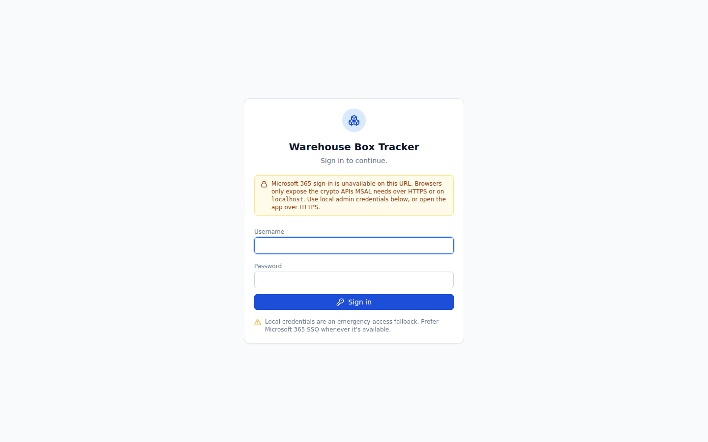

### 3.3 Αποσύνδεση

Σε υπολογιστή, πατήστε **Sign out** στο κάτω μέρος της αριστερής στήλης. Σε
κινητό, ανοίξτε το μενού χρήστη και επιλέξτε **Sign out**.

## 4. Πλοήγηση

Το κύριο μενού περιλαμβάνει:

- **Dashboard** — συνοπτική εικόνα αποθηκών,
- **Boxes** — αναζήτηση και διαχείριση κιβωτίων,
- **Requests** — αιτήματα εισαγωγής και επιστροφής,
- **Productivity** — ημερήσια παραγωγικότητα και μέσοι όροι,
- **Alerts** — ενεργές και ιστορικές ειδοποιήσεις,
- **Exports** — εξαγωγές CSV/XLSX,
- **Settings** — ρυθμίσεις διαχειριστή.

Ο κόκκινος αριθμός δίπλα στο **Alerts** δείχνει πόσες ανοικτές ειδοποιήσεις
υπάρχουν. Η ροζ λωρίδα στο επάνω μέρος οδηγεί επίσης στις ειδοποιήσεις.
Όταν υπάρχει σύνδεση δικτύου, οι βασικές λίστες και το Dashboard ανανεώνονται
αυτόματα μέσω live stream χωρίς χειροκίνητο refresh.

Σε κινητό:

- η βασική πλοήγηση εμφανίζεται στο κάτω μέρος,
- το μενού χρήστη ανοίγει από το επάνω κουμπί,
- οι πίνακες εμφανίζονται ως κάρτες ή οριζόντια κυλιόμενες λίστες.

## 5. Dashboard

Το **Dashboard** εμφανίζει μόνο ενεργές και προσβάσιμες αποθήκες.

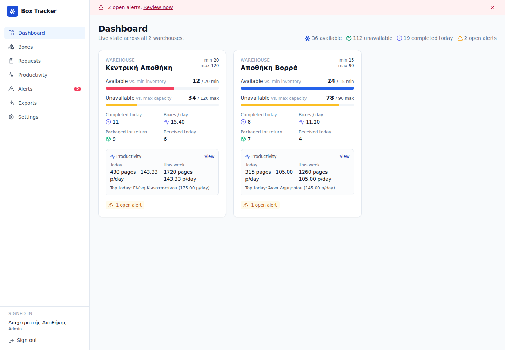

Κάθε κάρτα αποθήκης δείχνει:

- **Available**: κιβώτια σε κατάσταση `Received` ή `Processing`,
- **Unavailable**: κιβώτια σε κατάσταση `Incomplete` ή `Ready to Return`,
- σύγκριση διαθέσιμων κιβωτίων με το **Min inventory**,
- σύγκριση μη διαθέσιμων κιβωτίων με το **Max capacity**,
- ολοκληρώσεις, παραλαβές και επιστροφές της ημέρας,
- κιβώτια συσκευασμένα για επιστροφή,
- ημερήσια και εβδομαδιαία παραγωγικότητα,
- ανοικτές ειδοποιήσεις.

Πατήστε μια κάρτα αποθήκης για να ανοίξετε τη λίστα κιβωτίων φιλτραρισμένη στη
συγκεκριμένη αποθήκη. Πατήστε **View** στο τμήμα παραγωγικότητας για περισσότερα
στοιχεία.

## 6. Διαχείριση κιβωτίων

### 6.1 Καταστάσεις κιβωτίου

Η κανονική ακολουθία είναι:

1. **Received** — το κιβώτιο βρίσκεται στην αποθήκη και δεν έχει ανοιχτεί.
2. **Processing** — έχει ξεκινήσει η επεξεργασία.
3. **Incomplete** — η επεξεργασία έκλεισε χωρίς το κιβώτιο να είναι ακόμη
   έτοιμο για επιστροφή.
4. **Ready to Return** — το κιβώτιο είναι συσκευασμένο και διαθέσιμο για
   αίτημα επιστροφής.
5. **Returned** — το κιβώτιο παραδόθηκε πίσω και δεν αποτελεί ενεργό απόθεμα.

Ο Operator και ο Admin μπορούν να προχωρούν ένα βήμα τη φορά. Ο Admin μπορεί να
ενεργοποιήσει **Override rules (admin)** για έκτακτη αλλαγή κατάστασης ή
μετακίνηση. Απαιτείται αιτιολογία και η ενέργεια καταγράφεται ως διαχειριστική
παράκαμψη.

### 6.2 Λίστα και αναζήτηση

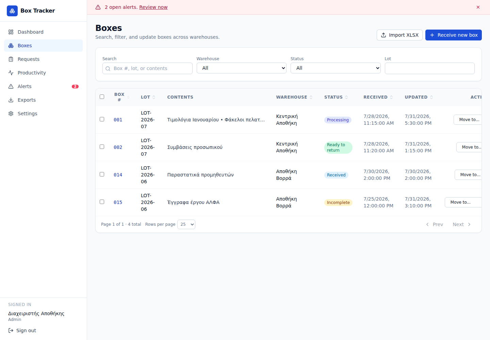

Στη σελίδα **Boxes** μπορείτε να:

- αναζητήσετε με αριθμό κιβωτίου, lot ή περιεχόμενα,
- φιλτράρετε ανά αποθήκη, κατάσταση και lot,
- ταξινομήσετε πατώντας τις επικεφαλίδες των στηλών,
- αλλάξετε το πλήθος αποτελεσμάτων ανά σελίδα,
- επιλέξετε πολλά κιβώτια για μαζική ενέργεια.

Η ταξινόμηση μιας στήλης λειτουργεί κυκλικά:

1. φθίνουσα,
2. αύξουσα,
3. επιστροφή στην προεπιλεγμένη ταξινόμηση.

### 6.3 Χειροκίνητη παραλαβή νέου κιβωτίου

1. Μεταβείτε στο **Boxes**.
2. Πατήστε **Receive new box**.
3. Επιλέξτε ενεργή αποθήκη.
4. Συμπληρώστε:
   - **Box number**,
   - **Lot**,
   - προαιρετικά **Contents**.
5. Πατήστε **Receive box**.

Ο αριθμός κανονικοποιείται σε τρία ψηφία όταν είναι αριθμητικός. Η μοναδικότητα
ελέγχεται ανά συνδυασμό lot και αριθμού κιβωτίου.

Η χειροκίνητη παραλαβή δημιουργεί αυτόματα ολοκληρωμένη εισερχόμενη απόδειξη
τύπου **Manual receipt**, ώστε το κιβώτιο να μπορεί αργότερα να συμμετάσχει στην
ίδια ροή επιστροφής με τα κιβώτια κανονικού αιτήματος.

### 6.4 Εισαγωγή κιβωτίων από XLSX

1. Πατήστε **Import XLSX**.
2. Επιλέξτε **Destination warehouse**.
3. Επιλέξτε αρχείο `.xlsx`.
4. Πατήστε **Preview workbook**.
5. Επιλέξτε φύλλο εργασίας, αν υπάρχουν περισσότερα από ένα.
6. Αντιστοιχίστε τις στήλες του αρχείου με:
   - αριθμό κιβωτίου,
   - lot από στήλη ή μία σταθερή τιμή lot για όλες τις γραμμές,
   - περιεχόμενα.
7. Όλες οι γραμμές περιλαμβάνονται αρχικά. Αποεπιλέξτε επικεφαλίδες, σύνολα ή
   άλλες άσχετες γραμμές.
8. Ελέγξτε τον αριθμό έγκυρων κιβωτίων.
9. Πατήστε **Import boxes**.

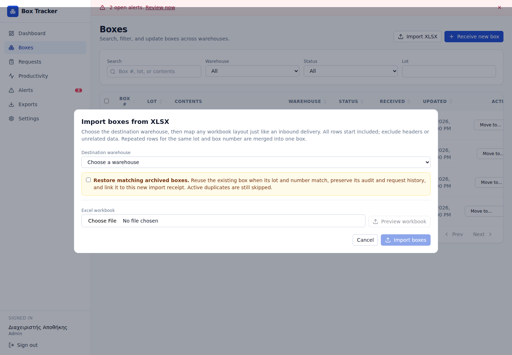

Σημαντικοί κανόνες:

- Κενές ή μη έγκυρες γραμμές παραλείπονται και εμφανίζονται στην αναφορά.
- Πολλαπλές γραμμές με ίδιο lot και ίδιο box number συγχωνεύονται σε ένα
  φυσικό κιβώτιο.
- Διαφορετικές τιμές περιεχομένων συνδυάζονται.
- Το συνολικό κείμενο περιεχομένων δεν μπορεί να υπερβεί τους 200 χαρακτήρες.
- Η εισαγωγή δημιουργεί αυτόματα ολοκληρωμένο **Imported receipt**.

#### Επαναφορά κατά λάθος αρχειοθετημένων κιβωτίων

Αν ένα κιβώτιο με ίδιο lot και box number υπάρχει αρχειοθετημένο:

1. ενεργοποιήστε **Restore matching archived boxes**,
2. εκτελέστε την εισαγωγή,
3. η εφαρμογή επαναφέρει την υπάρχουσα εγγραφή αντί να δημιουργήσει νέα,
4. διατηρείται ολόκληρο το ιστορικό και προστίθεται νέο συμβάν επαναφοράς.

Χρησιμοποιείτε αυτή την επιλογή μόνο όταν επιβεβαιώσετε ότι πρόκειται για το
ίδιο φυσικό κιβώτιο.

### 6.5 Μαζικές ενέργειες

1. Επιλέξτε τα πλαίσια δίπλα στα κιβώτια.
2. Χρησιμοποιήστε τη γραμμή μαζικών ενεργειών για:
   - αλλαγή κατάστασης,
   - μετακίνηση σε άλλη ενεργή αποθήκη,
   - διαγραφή/αρχειοθέτηση.
3. Ελέγξτε το αποτέλεσμα:
   - **updated/deleted** για επιτυχείς εγγραφές,
   - **skipped** για εγγραφές που προστατεύθηκαν από κανόνα.

Οι διαχειριστικές παρακάμψεις απαιτούν αιτιολογία. Αν κιβώτιο δεσμεύεται από
ενεργό αίτημα επιστροφής, μια εξαναγκασμένη μετακίνηση ή αρχειοθέτηση ακυρώνει
το επηρεαζόμενο αίτημα και δημιουργεί συμβάν ελέγχου.

### 6.6 Λεπτομέρειες και ιστορικό κιβωτίου

Πατήστε τον αριθμό ενός κιβωτίου για να δείτε:

- lot, περιεχόμενα και τρέχουσα αποθήκη,
- ημερομηνίες παραλαβής και επιστροφής,
- επόμενη επιτρεπόμενη κατάσταση,
- επιλογή μετακίνησης,
- πλήρες **Activity** με δημιουργία, αλλαγές, μετακινήσεις, επιστροφή,
  αρχειοθέτηση και επαναφορά.

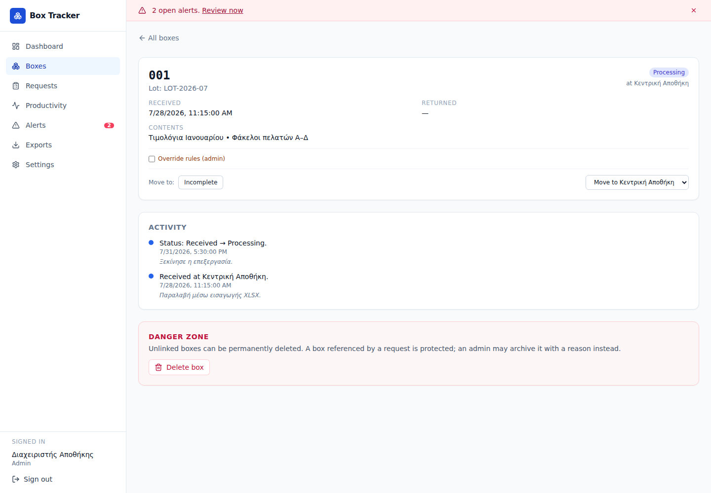

### 6.7 Διαγραφή και αρχειοθέτηση κιβωτίου

Στο **Danger zone**:

- μη συνδεδεμένο κιβώτιο μπορεί να διαγραφεί μόνιμα μαζί με το ιστορικό του,
- κιβώτιο που αναφέρεται σε αίτημα δεν διαγράφεται μόνιμα,
- ο Admin μπορεί να το αρχειοθετήσει με υποχρεωτική αιτιολογία,
- αρχειοθετημένο κιβώτιο κρύβεται από το ενεργό απόθεμα αλλά διατηρεί όλα τα
  συμβάντα και τις συνδέσεις αιτημάτων.

## 7. Αιτήματα εισαγωγής και επιστροφής

### 7.1 Καταστάσεις αιτήματος

| Κατάσταση | Περιγραφή |
| --- | --- |
| **Submitted** | Το αίτημα υποβλήθηκε και περιμένει απόφαση. |
| **Approved** | Ο μεταφορέας το ενέκρινε· η προετοιμασία δεν έχει ξεκινήσει. |
| **Preparing inbound / Preparing return** | Γίνεται η φυσική προετοιμασία της παράδοσης ή επιστροφής. |
| **Ready for dispatch / Ready for collection** | Η προετοιμασία ολοκληρώθηκε και αναμένεται έναρξη μεταφοράς. |
| **Delivering / Collecting** | Η φυσική μεταφορά βρίσκεται σε εξέλιξη. |
| **Delivered · awaiting requester confirmation / Collected · awaiting warehouse confirmation** | Η μεταφορά έφτασε και αναμένεται η σωστή τελική επιβεβαίωση. |
| **Completed** | Η παράδοση ή επιστροφή έγινε αποδεκτή. |
| **Rejected** | Το αίτημα απορρίφθηκε με αιτιολογία. |
| **Cancelled** | Το αίτημα ακυρώθηκε. |

Η λίστα υποστηρίζει φίλτρα αποθήκης, κατεύθυνσης και κατάστασης.

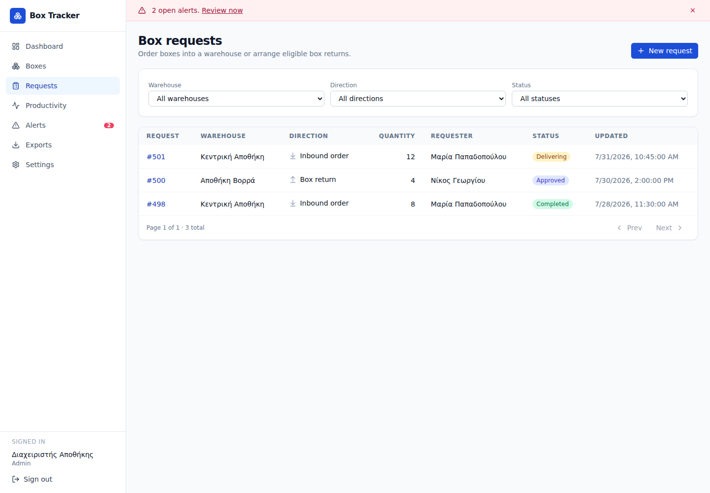

### 7.2 Νέο εισερχόμενο αίτημα

1. Πατήστε **New request**.
2. Επιλέξτε **Inbound order**.
3. Επιλέξτε αποθήκη.
4. Ελέγξτε το πλαίσιο **Recommendation**:
   - διαθέσιμα κιβώτια,
   - ελάχιστο απόθεμα,
   - εισερχόμενα που ήδη εκκρεμούν,
   - προτεινόμενη ποσότητα.
5. Διατηρήστε ή αλλάξτε την ποσότητα.
6. Πατήστε **Submit request**.

Η πρόταση υπολογίζεται ως η ποσότητα που απαιτείται για να καλυφθεί το ελάχιστο
απόθεμα, λαμβάνοντας υπόψη τις ενεργές εισερχόμενες παραγγελίες.

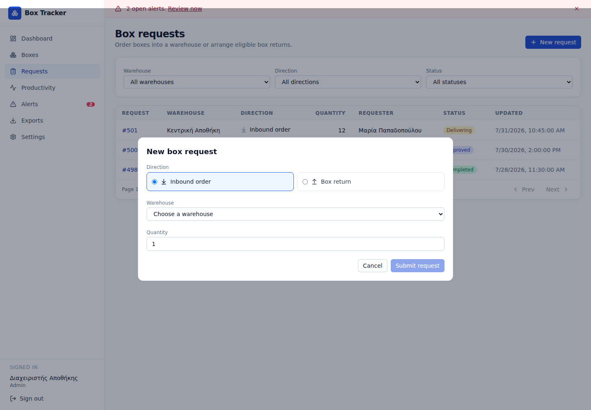

### 7.3 Εκτέλεση εισερχόμενου αιτήματος

1. Ο μεταφορέας ανοίγει αίτημα **Submitted**.
2. Επιλέγει **Approve** ή **Reject**. Η απόρριψη απαιτεί αιτιολογία.
3. Πατά **Prepare inbound** όταν αρχίσει η φυσική προετοιμασία.
4. Πατά **Ready for dispatch** όταν τα κιβώτια είναι έτοιμα.
5. Δημιουργεί το δελτίο παράδοσης στο ERP.
6. Στο **ERP documents** επιλέγει **Delivery note**, γράφει το ERP reference,
   επιλέγει PDF/JPEG/PNG και πατά **Upload document**.
7. Πατά **Mark as delivering**. Το κουμπί ενεργοποιείται μόνο όταν υπάρχει
   τρέχον δελτίο παράδοσης.
8. Ο μεταφορέας πατά **Mark delivered** όταν ολοκληρωθεί η φυσική παράδοση.
9. Ο αρχικός αιτών ή ο Admin ελέγχει ποσότητες/διαφορές και πατά **Confirm
   delivery**.

Ο αρχικός αιτών ή ο Admin μπορεί να ακυρώσει αίτημα όσο είναι **Submitted** ή
πριν ξεκινήσει η μεταφορά (μέχρι **Ready for dispatch/collection**), εφόσον δεν
υπάρχει ανοικτή επιχειρησιακή εξαίρεση. Η αιτιολογία ακύρωσης είναι προαιρετική.
Μετά την έναρξη της
μεταφοράς δεν επιτρέπεται κανονική ακύρωση από το περιβάλλον χρήστη.

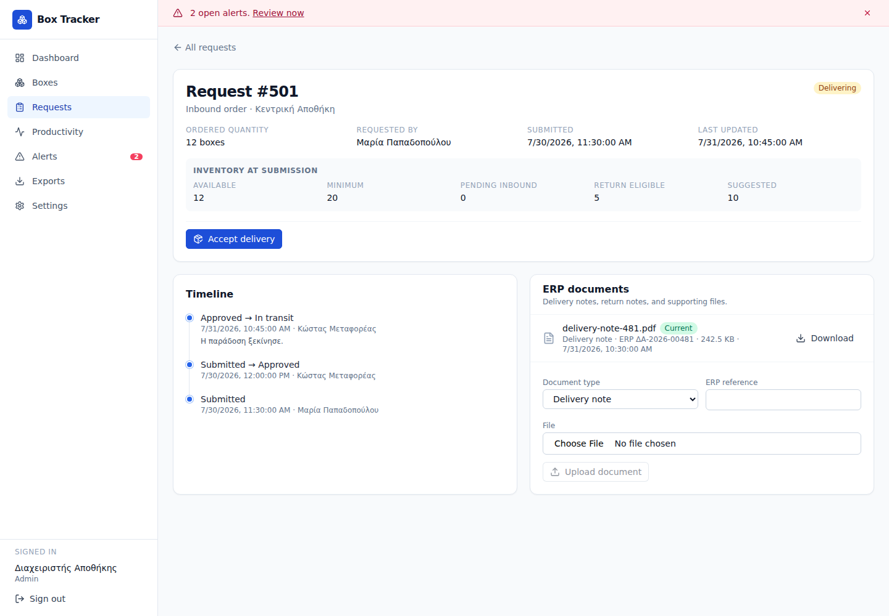

### 7.4 Αποδοχή παράδοσης

Κατά το **Confirm delivery** ο χρήστης μπορεί να καταχωρίσει τα κιβώτια:

- χειροκίνητα, προσθέτοντας γραμμές lot/box number/contents,
- από XLSX μέσω προεπισκόπησης και αντιστοίχισης στηλών.

Στην εισαγωγή XLSX:

1. επιλέξτε αρχείο και φύλλο,
2. αντιστοιχίστε lot, box number και contents,
3. όλες οι γραμμές είναι αρχικά ενεργές,
4. εξαιρέστε επικεφαλίδες και άσχετες γραμμές,
5. οι επαναλαμβανόμενες γραμμές ίδιου κιβωτίου συγχωνεύονται,
6. ελέγξτε την πραγματική ποσότητα πριν την ολοκλήρωση.

#### Διαφορά παραγγελθείσας και πραγματικής ποσότητας

Αν η πραγματική ποσότητα διαφέρει:

- **έλλειψη**: η παράδοση ολοκληρώνεται με την πραγματική ποσότητα και
  καταγράφεται αρνητική διαφορά,
- **πλεόνασμα**: ο αιτών μπορεί να αποδεχθεί όλα τα επιπλέον κιβώτια,
- και στις δύο περιπτώσεις απαιτείται **Discrepancy reason**.

Το αίτημα αποθηκεύει:

- ordered quantity,
- actually received,
- variance,
- discrepancy reason.

### 7.5 Νέο αίτημα επιστροφής

Η επιστροφή αντιστρέφει συγκεκριμένη ολοκληρωμένη εισερχόμενη παραγγελία.

1. Πατήστε **New request**.
2. Επιλέξτε **Return order**.
3. Επιλέξτε αποθήκη.
4. Επιλέξτε **Completed inbound order**.
5. Η εφαρμογή εμφανίζει μόνο τα μη δεσμευμένα κιβώτια της παραγγελίας που
   βρίσκονται στην ίδια αποθήκη και είναι **Ready to Return**.
6. Όλα τα επιλέξιμα κιβώτια επιλέγονται αρχικά.
7. Αποεπιλέξτε όσα θα παραμείνουν για μεταγενέστερη μερική επιστροφή.
8. Πατήστε **Submit request**.

Μπορούν να δημιουργηθούν διαδοχικά αιτήματα επιστροφής από την ίδια εισερχόμενη
παραγγελία, μέχρι να μη μείνει επιλέξιμο κιβώτιο.

### 7.6 Εκτέλεση επιστροφής

1. Ο μεταφορέας εγκρίνει ή απορρίπτει το αίτημα.
2. Πατά **Prepare return** και, όταν ολοκληρωθεί η προετοιμασία, **Ready for
   collection**.
3. Ανεβάζει τρέχον **Return note** με ERP reference.
4. Πατά **Start collection**.
5. Μετά τη φυσική παραλαβή πατά **Mark collected**.
6. Ο μεταφορέας ή ο Admin ελέγχει τα πραγματικά συλλεγμένα κιβώτια και πατά
   **Confirm warehouse receipt**.
7. Τα επιλεγμένα κιβώτια γίνονται **Returned** μόνο στην τελική επιβεβαίωση.

### 7.7 Παραστατικά ERP

Υποστηρίζονται:

- **Delivery note**,
- **Return note**,
- **Other**.

Κάθε αρχείο συνοδεύεται από ERP reference. Η μεταφόρτωση νεότερης έκδοσης:

- την ορίζει ως **Current**,
- κρατά τις προηγούμενες εκδόσεις για έλεγχο,
- δεν διαγράφει το ιστορικό.

Τα αρχεία αποθηκεύονται ιδιωτικά. Η λήψη περνά από την εφαρμογή, άρα απαιτεί
σύνδεση και δικαίωμα στην αποθήκη. Σε ολοκληρωμένες αυτοπαραλαβές από manual ή
XLSX import, ο αιτών ή ο Admin μπορεί επίσης να προσθέσει έγγραφα ERP.

### 7.8 Διαφορές, φωτογραφίες και μερική εκπλήρωση

Στην τελική επιβεβαίωση μπορείτε να προσθέσετε δομημένες διαφορές ανά γραμμή ή
συνολικά:

- **Missing** και **Unexpected** για έλλειψη ή πλεόνασμα,
- **Damaged**, **Wrong lot**, **Wrong contents** και **Rejected**,
- επηρεαζόμενη ποσότητα, συγκεκριμένο κιβώτιο και σημείωση.

Μετά την καταγραφή εμφανίζεται ενότητα **Fulfillment discrepancies**. Σε κάθε
διαφορά μπορείτε να ανεβάσετε φωτογραφία JPEG/PNG. Η φωτογραφία αποθηκεύεται
ιδιωτικά, συνδέεται με τη συγκεκριμένη διαφορά και καταγράφονται χρήστης, ώρα,
μέγεθος και hash αρχείου.

Αν μια εισερχόμενη παράδοση είναι μικρότερη:

1. ολοκληρώνεται μόνο η πραγματική ποσότητα,
2. δημιουργείται αυτόματα νέο **Backorder** σε κατάσταση **Submitted** για το
   υπόλοιπο,
3. το νέο αίτημα συνδέεται με parent/root request για πλήρη ιχνηλασιμότητα.

Αν μια επιστροφή συλλεχθεί μερικώς:

1. τα συλλεγμένα κιβώτια γίνονται `Returned`,
2. οι μη συλλεγμένες δεσμεύσεις απελευθερώνονται,
3. δημιουργείται μη δεσμευτικό follow-up **Draft**,
4. ο αιτών επιλέγει εκ νέου επιλέξιμα κιβώτια και πατά **Submit follow-up**.

### 7.9 Συντονισμός, ανάθεση και συνεργασία

Η κάρτα συντονισμού υποστηρίζει:

- προτεραιότητα **Low / Normal / High / Urgent**,
- requested date, SLA deadline και προγραμματισμένο παράθυρο έναρξης/λήξης,
- ανάθεση σε ενεργό Admin ή Warehouse Mover με πρόσβαση στην αποθήκη,
- destination contact, internal location και special handling instructions.

Κάθε αλλαγή απαιτεί την τρέχουσα έκδοση του αιτήματος. Αν άλλος χρήστης έχει
ήδη αλλάξει το αίτημα, εμφανίζεται σύγκρουση έκδοσης και πρέπει να ελέγξετε τη
νεότερη κατάσταση πριν επαναλάβετε. Η ανάθεση, ο προγραμματισμός και οι λοιπές
αλλαγές γράφονται ξεχωριστά στο Timeline.

Στο **Discussion** όλοι οι χρήστες με πρόσβαση μπορούν να προσθέσουν σχόλιο.
Αιτών και συντονιστές μπορούν επίσης να ανεβάσουν υποστηρικτικά PDF, εικόνες,
TXT, CSV, XLSX ή DOCX. Αυτά είναι attachments και όχι επίσημα ERP documents.

### 7.10 Ουρές εργασίας

Στη λίστα **Requests** υπάρχουν ουρές για:

- μη ανατεθειμένα, σημερινά και εκπρόθεσμα αιτήματα,
- **Ready for transport**,
- **Awaiting confirmation**,
- staged receipts που περιμένουν διοικητικό έλεγχο.

Οι ουρές, τα φίλτρα κατάστασης/κατεύθυνσης/προτεραιότητας και η ταξινόμηση
λειτουργούν μαζί. Οι ενεργές καταστάσεις μετρούν σε pending inbound, κρατούν τις
δεσμεύσεις επιστροφής και εμποδίζουν αρχειοθέτηση αποθήκης.

### 7.11 Hold, reschedule και αποτυχημένη μεταφορά

Αυτές είναι **επιχειρησιακές εξαιρέσεις**, όχι νέες καταστάσεις lifecycle. Η
τρέχουσα κατάσταση παραμένει ορατή και εμφανίζεται ξεχωριστή προειδοποίηση.

**Hold / Resume**

1. Ο συντονιστής πατά **Hold** και γράφει υποχρεωτικό λόγο.
2. Οι επόμενες lifecycle ενέργειες μπλοκάρονται.
3. Το SLA παγώνει για τη διάρκεια του hold.
4. Με **Resume** γράφεται η επίλυση, επεκτείνεται ανάλογα το SLA και η ροή
   συνεχίζει μόνο από την έγκυρη προηγούμενη κατάσταση.

**Reschedule**

1. Πατήστε **Reschedule**.
2. Συμπληρώστε λόγο και νέο έγκυρο παράθυρο.
3. Το νέο παράθυρο, οι παλιές/νέες τιμές και η επίδραση στο SLA
   καταγράφονται. Η εξαίρεση κλείνει αμέσως ως επιλυμένη αλλαγή προγράμματος.

**Failed transport / Retry**

1. Όσο το αίτημα είναι **Delivering/Collecting**, πατήστε **Report failed
   transport**.
2. Γράψτε λόγο και, προαιρετικά, νέο πλήρες παράθυρο.
3. Δεν επιτρέπεται να σημειωθεί άφιξη όσο η αποτυχία είναι ανοικτή.
4. Με **Retry transport** γράψτε την επίλυση. Το αίτημα επιστρέφει μόνο σε
   **Ready for dispatch/collection**, εφαρμόζει το νέο παράθυρο/SLA και απαιτεί
   ξανά **Start delivery/collection**.

Κάθε εξαίρεση κρατά kind, reason, revised window, resume target, actor/time και
resolution actor/time. Μη έγκυρος ή χειροκίνητα αλλοιωμένος resume target
απορρίπτεται. Όλες οι ενέργειες απαιτούν mover/admin, warehouse ACL και
`expected_version`, δημιουργούν audit event και ειδοποίηση.

### 7.12 Ειδοποιήσεις αιτημάτων και προτιμήσεις email

Το καμπανάκι εμφανίζει ειδοποιήσεις για υποβολή, έγκριση/απόρριψη, ανάθεση,
προγραμματισμό, προετοιμασία, ετοιμότητα, μεταφορά, αναμονή επιβεβαίωσης,
ολοκλήρωση, σχόλια, έγγραφα, hold/resume/reschedule, αποτυχημένη μεταφορά,
retry και SLA overdue. Οι SSE ενημερώσεις ανανεώνουν λίστες και λεπτομέρειες.

Από τις προτιμήσεις χρήστη μπορείτε να απενεργοποιήσετε **request emails**
χωρίς να χάσετε in-app ειδοποιήσεις. Οι Admin μπορούν να διαχειρίζονται την
αντίστοιχη επιλογή χρηστών. Τα email μπαίνουν σε ανθεκτική ουρά με
idempotency/retries· αποτυχία email δεν αναιρεί την επιχειρησιακή ενέργεια.

### 7.13 Αποθηκευμένες αντιστοιχίσεις XLSX

Μετά την αντιστοίχιση φύλλου/στηλών μπορείτε να αποθηκεύσετε template ανά use
case και, προαιρετικά, αποθήκη. Την επόμενη φορά εμφανίζονται προτάσεις βάσει
ονόματος αρχείου, φύλλου και headers. Μπορείτε να εφαρμόσετε, τροποποιήσετε,
μετονομάσετε ή διαγράψετε template και να επιβεβαιώσετε πάντα την προεπισκόπηση
πριν την εισαγωγή.

### 7.14 Reconciliation, analytics και exports

Η σελίδα **Request reporting / reconciliation** συγκεντρώνει:

- shortages/excess και typed discrepancies,
- ανοικτά backorders/follow-ups,
- missing/superseded ERP documents,
- διοικητικές παρακάμψεις και ακυρωμένες δεσμεύσεις,
- αιτήματα που αναμένουν επιβεβαίωση, SLA breaches και staged review,
- ανοικτά holds ή failed transport.

Τα φίλτρα αποθήκης, assignee, ημερομηνίας, severity και issue type σέβονται τα
ACL. Κάθε issue οδηγεί στο σχετικό request/box. Τα analytics δείχνουν χρόνους
approval, preparation, transport και acceptance μόνο όταν υπάρχουν πραγματικά
milestone timestamps· παλιές εγγραφές δεν αποκτούν τεχνητά ορόσημα. Επίσης
δείχνουν on-time/discrepancy/shortage/overage rates, λόγους απόρριψης/ακύρωσης
και throughput ανά αποθήκη/mover. CSV/XLSX exports χρησιμοποιούν τα ίδια φίλτρα
και δικαιώματα.

### 7.15 Εξηγήσεις προτάσεων και ρυθμίσεις

Η πρόταση εισερχόμενης ποσότητας εξηγεί τα δεδομένα και τον τύπο:

- διαθέσιμο/κατειλημμένο απόθεμα και minimum,
- εκκρεμή inbound/backorders και προγραμματισμένες επιστροφές,
- 30/90 ημερών κατανάλωση και βάρη ιστορικού,
- lead time, forecast, safety stock και confidence,
- capacity cap και προαιρετικό admin adjustment,
- fallback στο απλό minimum gap όταν το ιστορικό δεν επαρκεί.

Ο Admin ρυθμίζει ανά αποθήκη lead-time days, safety-stock %, βάρη 30/90 ημερών
και forecast adjustment. Για return η πρόταση είναι τα μη δεσμευμένα,
επιλέξιμα `Ready to Return` κιβώτια της επιλεγμένης inbound παραγγελίας.

### 7.16 Staged receipts, governance και quarantine

Manual/XLSX παραλαβές μπορούν να ολοκληρώνονται αυτόματα ή να δημιουργούν
**staged receipt** χωρίς άμεση αλλαγή φυσικού αποθέματος. Η πολιτική αποθήκης
μπορεί να απαιτεί:

- **Admin review**,
- τρέχον delivery note,
- διαφορετικό δεύτερο Admin πάνω από όριο ποσότητας,
- quarantine για import ή manual receipt,
- ελεγχόμενη επαναφορά αρχειοθετημένης ταυτότητας.

Στο finalize γίνεται ξανά έλεγχος διπλοτύπων, χωρητικότητας, ACL, εγγράφου και
πολιτικής. Τα νέα κιβώτια δημιουργούνται τότε σε `Received` ή `Quarantined`.
Μόνο Admin μπορεί να κάνει release από quarantine ή reject/archive με
αιτιολογία. Οι αλλαγές πολιτικής και όλες οι αποφάσεις διατηρούν audit trail.

### 7.17 Όριο της σύνδεσης ERP

Η εφαρμογή **δεν συνδέεται αυτόματα με ERP**. Χρησιμοποιεί χειροκίνητο ERP
reference και versioned upload. Η μελλοντική σύνδεση έχει αναβληθεί μέχρι να
συμφωνηθούν συμβόλαια, ασφάλεια, authority, idempotency και λειτουργική
υποστήριξη· δείτε το [ERP integration deferred
TODO](./ERP_INTEGRATION_TODO.md).

## 8. Παραγωγικότητα

### 8.1 Συνοπτική σελίδα

Η σελίδα **Productivity** υποστηρίζει:

- **Today**,
- **This week**,
- **This month**,
- **3 months** (κυλιόμενο παράθυρο 90 ημερών).

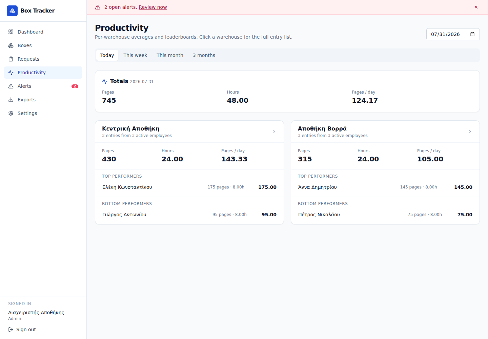

Εμφανίζονται:

- συνολικές σελίδες,
- συνολικές ώρες,
- μέσος ρυθμός σελίδων ανά κανονικοποιημένη εργάσιμη ημέρα,
- καλύτερος και χαμηλότερος εργαζόμενος ανά αποθήκη.

Πατήστε μια κάρτα αποθήκης για αναλυτική προβολή.

### 8.2 Καταχώριση ημερήσιων στοιχείων

Στην αναλυτική προβολή:

1. επιλέξτε ημερομηνία,
2. βρείτε τον εργαζόμενο,
3. καταχωρίστε **Pages** και **Hours worked**,
4. προσθέστε προαιρετική σημείωση,
5. αποθηκεύστε.

Κανόνες:

- οι σελίδες πρέπει να είναι ακέραιος αριθμός μεγαλύτερος από μηδέν,
- οι ώρες πρέπει να είναι από 0,25 έως 24, σε βήματα των 0,25,
- νέα αποθήκευση για ίδιο εργαζόμενο και ημερομηνία ενημερώνει την υπάρχουσα
  εγγραφή,
- αν ο εργαζόμενος ή η εγγραφή έχει εξαιρεθεί από τα metrics, δεν συμμετέχει
  στα σύνολα.

### 8.3 Μέσοι όροι και ελάχιστο όριο

Ο Admin ορίζει ανά αποθήκη το **Min pages / day**. Για κάθε εργαζόμενο
υπολογίζονται εβδομαδιαίος, μηνιαίος και κυλιόμενος μέσος όρος 90 ημερών.

Ένας εργαζόμενος σημειώνεται ως σταθερά κάτω από το ελάχιστο μόνο όταν και οι
τρεις περίοδοι έχουν δεδομένα και όλοι οι αντίστοιχοι μέσοι όροι είναι
χαμηλότεροι από το όριο.

Η ένδειξη είναι εργαλείο εντοπισμού τάσης και όχι αυτόματη αξιολόγηση προσωπικού.
Ελέγχετε πάντα άδειες, μερική απασχόληση, ποιότητα εργασίας και εξαιρέσεις.

## 9. Ειδοποιήσεις

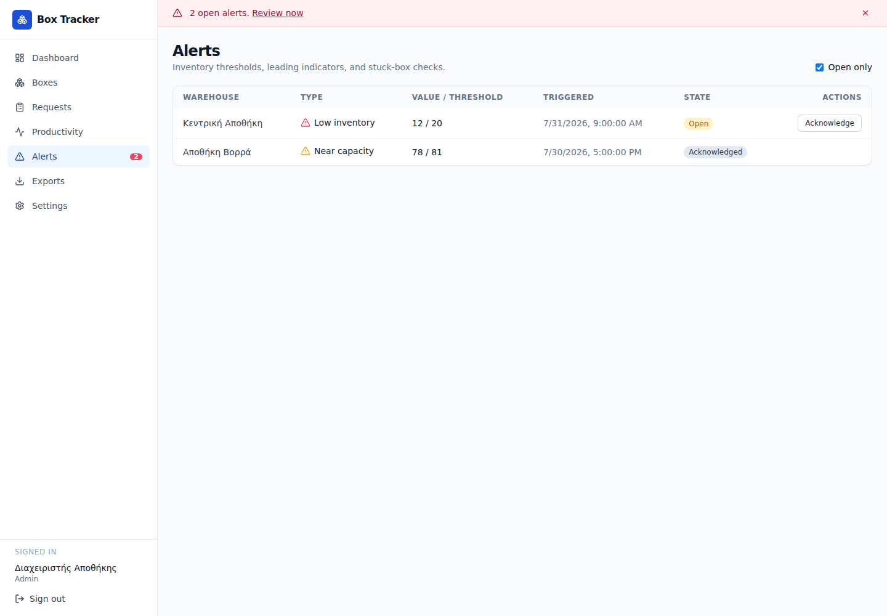

Τύποι ειδοποίησης:

- **Low inventory** — διαθέσιμα κάτω από το ελάχιστο,
- **Near low inventory** — τα διαθέσιμα πλησιάζουν το ελάχιστο,
- **Max capacity** — μη διαθέσιμα στο μέγιστο,
- **Near capacity** — τα μη διαθέσιμα πλησιάζουν το μέγιστο,
- **Boxes stuck** — κιβώτια που παραμένουν `Received` περισσότερο από το
  επιτρεπόμενο διάστημα.

Χρήση:

1. ενεργοποιήστε/απενεργοποιήστε **Open only**,
2. πατήστε το όνομα αποθήκης για λεπτομέρειες,
3. Operator ή Admin μπορεί να πατήσει **Acknowledge**,
4. η αναγνώριση δηλώνει ότι κάποιος ανέλαβε το θέμα· δεν το επιλύει,
5. η ειδοποίηση κλείνει αυτόματα όταν πάψει να ισχύει η συνθήκη.

Πιθανές καταστάσεις:

- **Open**,
- **Acknowledged**,
- **Escalated**,
- **Resolved**.

Στη λεπτομέρεια εμφανίζεται το ιστορικό αποστολών email. Ο Admin μπορεί να
στείλει δοκιμαστικό email όταν έχει ρυθμιστεί το Microsoft Graph.

## 10. Εξαγωγές

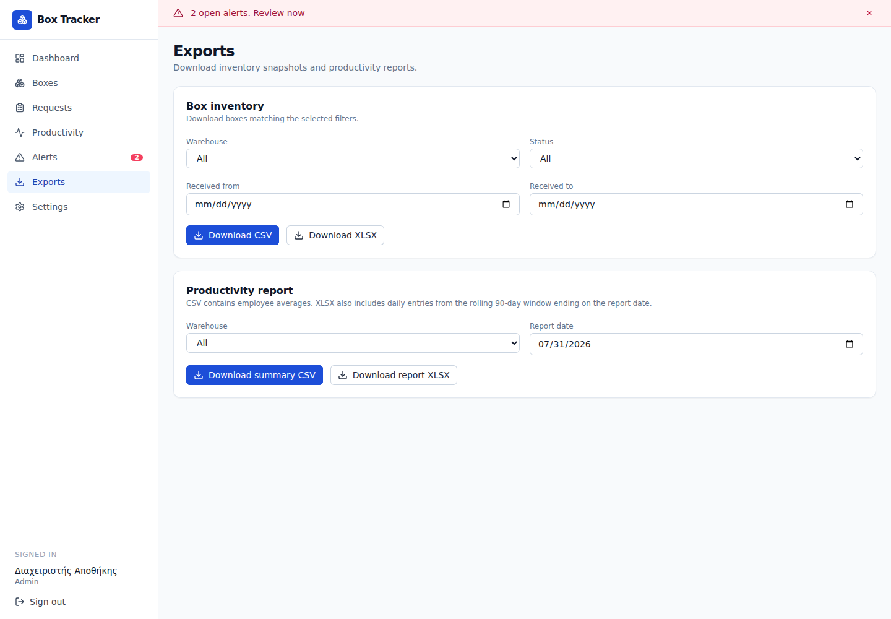

### 10.1 Απόθεμα κιβωτίων

1. Επιλέξτε προαιρετικά αποθήκη.
2. Επιλέξτε κατάσταση.
3. Ορίστε **Received from** και **Received to**.
4. Πατήστε **Download CSV** ή **Download XLSX**.

Η εξαγωγή σέβεται τα φίλτρα και τα δικαιώματα αποθηκών. Οι αρχειοθετημένες
αποθήκες εμφανίζονται με ένδειξη `(archived)` για ιστορικές αναφορές.

### 10.2 Αναφορά παραγωγικότητας

1. Επιλέξτε προαιρετικά αποθήκη.
2. Ορίστε **Report date**.
3. Επιλέξτε:
   - **Download summary CSV** για μέσους όρους εργαζομένων,
   - **Download report XLSX** για σύνοψη και ημερήσιες εγγραφές 90 ημερών.

## 11. Ρυθμίσεις διαχειριστή

Η σελίδα **Settings** εμφανίζεται μόνο σε Admin.

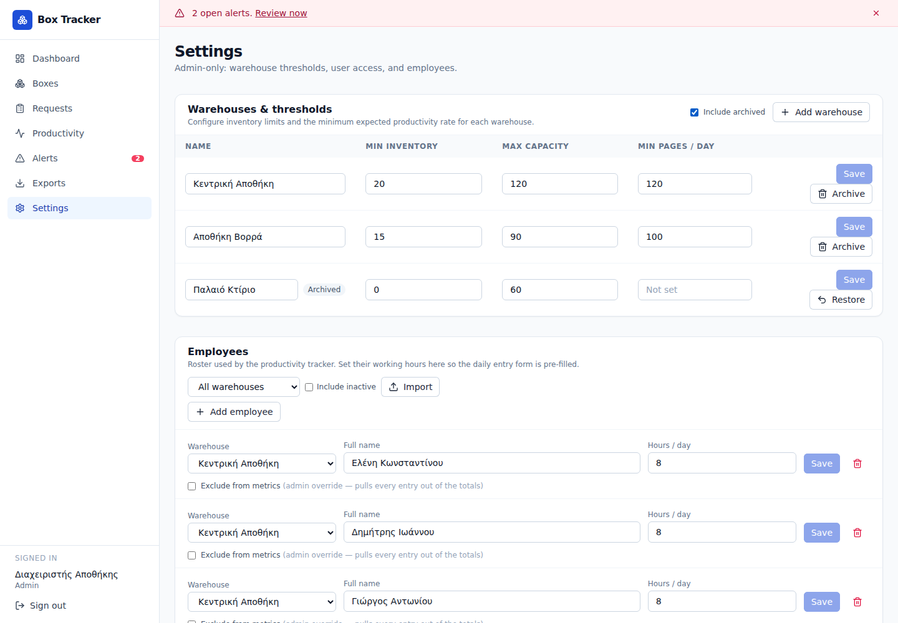

### 11.1 Αποθήκες και όρια

Για κάθε αποθήκη ορίζονται:

- **Name**,
- **Min inventory**,
- **Max capacity**,
- **Min pages / day**.

Το ελάχιστο απόθεμα πρέπει να είναι μικρότερο από τη μέγιστη χωρητικότητα.
Πατήστε **Save** μετά από κάθε αλλαγή.

### 11.2 Προσθήκη αποθήκης

1. Πατήστε **Add warehouse**.
2. Συμπληρώστε όνομα και όρια.
3. Πατήστε **Create**.
4. Η νέα αποθήκη γίνεται άμεσα διαθέσιμη σε επιχειρησιακές επιλογές.
5. Αναθέστε την στους κατάλληλους μη διαχειριστικούς χρήστες.

### 11.3 Αρχειοθέτηση ολόκληρης αποθήκης

Το **Archive** είναι αναστρέψιμη λογική διαγραφή. Δεν διαγράφει ιστορικά
δεδομένα.

Η αρχειοθέτηση μπλοκάρεται όταν:

- είναι η τελευταία ενεργή αποθήκη,
- περιέχει μη αρχειοθετημένο κιβώτιο που δεν είναι `Returned`,
- έχει αίτημα `Submitted`, `Approved` ή `In transit`.

Αν εμφανιστεί σύγκρουση, το μήνυμα αναφέρει πόσα ενεργά κιβώτια και ανοικτά
αιτήματα πρέπει να διευθετηθούν.

Μετά από επιτυχή αρχειοθέτηση:

- καταγράφονται ο χρήστης και η ώρα,
- οι εργαζόμενοι της αποθήκης απενεργοποιούνται,
- οι ανοικτές ειδοποιήσεις επιλύονται,
- η αποθήκη αφαιρείται από Dashboard, προορισμούς, εισαγωγές και
  προγραμματισμένες αναφορές,
- δεν επιτρέπεται νέα επιχειρησιακή μεταβολή σε αυτή,
- διατηρούνται κιβώτια, συμβάντα, αιτήματα, παραγωγικότητα, ειδοποιήσεις και ACL.

Για επαναφορά:

1. ενεργοποιήστε **Include archived**,
2. βρείτε τη γραμμή με ένδειξη **Archived**,
3. πατήστε **Restore**.

Η επαναφορά δεν επανενεργοποιεί αυτόματα εργαζομένους και παλιές ειδοποιήσεις.
Επανενεργοποιήστε μόνο όσους εργαζομένους χρειάζονται.

### 11.4 Εργαζόμενοι

Ο Admin μπορεί να:

- προσθέσει εργαζόμενο,
- αλλάξει όνομα, αποθήκη και προεπιλεγμένες ώρες,
- επιλέξει **Exclude from metrics**,
- απενεργοποιήσει εργαζόμενο χωρίς διαγραφή ιστορικού,
- εμφανίσει ανενεργούς με **Include inactive**,
- επανενεργοποιήσει εργαζόμενο.

Η διαγραφή εργαζομένου είναι soft delete: οι παλιές εγγραφές παραγωγικότητας
διατηρούνται.

### 11.5 Εισαγωγή εργαζομένων από XLSX

1. Στην ενότητα **Employees**, πατήστε **Import**.
2. Επιλέξτε αποθήκη και αρχείο XLSX.
3. Επιλέξτε φύλλο.
4. Αντιστοιχίστε:
   - **Full name** — υποχρεωτικό,
   - **Hours / day**,
   - **Active**,
   - **Excluded**.
5. Όλες οι γραμμές επιλέγονται αρχικά. Αποεπιλέξτε επικεφαλίδες ή άσχετες
   γραμμές.
6. Πατήστε **Import employees**.

Αν υπάρχει ήδη εργαζόμενος με ίδιο όνομα στην ίδια αποθήκη, ενημερώνεται χωρίς
διάκριση πεζών/κεφαλαίων. Η τελική αναφορά δείχνει created, updated και skipped.

### 11.6 Χρήστες και πρόσβαση

Στην ενότητα **Users** μπορείτε να:

- αλλάξετε ή να καρφιτσώσετε ρόλο με role override,
- ενεργοποιήσετε/απενεργοποιήσετε χρήστη,
- ενεργοποιήσετε/απενεργοποιήσετε emails ειδοποιήσεων,
- αναθέσετε ενεργές αποθήκες.

Οι ήδη υπάρχουσες συνδέσεις χρήστη με αρχειοθετημένες αποθήκες διατηρούνται για
ιστορική ανάγνωση. Δεν επιτρέπεται νέα ανάθεση αρχειοθετημένης αποθήκης.

### 11.7 Παραλήπτες ειδοποιήσεων

Η προεπισκόπηση παραληπτών δείχνει:

- τους κύριους παραλήπτες ανά ενεργή αποθήκη,
- τους παραλήπτες κλιμάκωσης.

Χρησιμοποιήστε την για να επιβεβαιώσετε ότι η απενεργοποίηση email ενός χρήστη
δεν αφήνει αποθήκη χωρίς παραλήπτη.

## 12. Ιστορικό και ακεραιότητα δεδομένων

Η εφαρμογή προστατεύει τις σχέσεις μεταξύ κιβωτίων, αιτημάτων και αποθηκών:

- ολοκληρωμένα αιτήματα παραμένουν αναγνώσιμα,
- τα ονόματα αρχειοθετημένων αποθηκών εξακολουθούν να εμφανίζονται,
- τα συμβάντα δεν αλλάζουν όταν μετακινείται ή αρχειοθετείται κιβώτιο,
- τα προηγούμενα ERP documents διατηρούνται,
- οι διαχειριστικές παρακάμψεις απαιτούν αιτιολογία,
- οι ενεργές επιστροφές προστατεύουν τα δεσμευμένα κιβώτια.

Αποφεύγετε απευθείας αλλαγές στη βάση δεδομένων, επειδή παρακάμπτουν τους
ελέγχους, το audit trail και τις αυτόματες ακυρώσεις.

## 13. Εγκατάσταση ως εφαρμογή κινητού

### iPhone/iPad

1. Ανοίξτε την εφαρμογή στο Safari.
2. Πατήστε **Share**.
3. Επιλέξτε **Add to Home Screen**.
4. Επιβεβαιώστε με **Add**.

### Android

1. Ανοίξτε την εφαρμογή σε Chrome ή Edge.
2. Πατήστε **Install app** ή **Add to Home screen**.
3. Επιβεβαιώστε την εγκατάσταση.

Η εφαρμογή μπορεί να δείξει πρόσφατα φορτωμένες λίστες χωρίς σύνδεση, αλλά όλες
οι εγγραφές και μεταβολές απαιτούν δίκτυο. Δεν υπάρχει ουρά offline αλλαγών.

## 14. Αντιμετώπιση συνηθισμένων προβλημάτων

### Δεν βλέπω μια αποθήκη

- Ελέγξτε αν σας έχει ανατεθεί.
- Ελέγξτε αν έχει αρχειοθετηθεί.
- Ζητήστε από Admin να ελέγξει **Settings → Users**.

### Δεν μπορώ να μετακινήσω ή να αλλάξω κιβώτιο

- Ελέγξτε τον ρόλο σας.
- Ελέγξτε αν το κιβώτιο είναι αρχειοθετημένο ή `Returned`.
- Ελέγξτε αν συνδέεται με αίτημα ή ενεργή επιστροφή.
- Ο Admin μπορεί να χρησιμοποιήσει override μόνο με τεκμηριωμένη αιτιολογία.

### Δεν μπορώ να ξεκινήσω παράδοση ή συλλογή

- Το αίτημα πρέπει να είναι **Approved**.
- Πρέπει να υπάρχει τρέχον σωστό ERP document:
  - Delivery note για inbound,
  - Return note για return.

### Δεν μπορώ να ολοκληρώσω εισερχόμενη παράδοση

- Μόνο ο αρχικός αιτών ή ο Admin μπορεί να την αποδεχθεί.
- Ελέγξτε για διπλά lot/box number.
- Αν η ποσότητα διαφέρει, συμπληρώστε discrepancy reason.
- Ελέγξτε ότι το συνδυασμένο contents δεν ξεπερνά 200 χαρακτήρες.

### Δεν εμφανίζεται κιβώτιο για επιστροφή

Πρέπει ταυτόχρονα:

- να ανήκει στην επιλεγμένη ολοκληρωμένη inbound order,
- να βρίσκεται στην ίδια αποθήκη,
- να είναι **Ready to Return**,
- να μην είναι αρχειοθετημένο,
- να μην έχει δεσμευτεί από άλλο ενεργό return request.

### Η αρχειοθέτηση αποθήκης αποτυγχάνει

Μετακινήστε, επιστρέψτε ή αρχειοθετήστε τα ενεργά κιβώτια και κλείστε όλα τα
ανοικτά αιτήματα. Δεν μπορεί να αρχειοθετηθεί η τελευταία ενεργή αποθήκη.

### Το PDF φαίνεται μαύρο στον Firefox

Αν το ίδιο αρχείο ανοίγει σωστά σε Acrobat ή Chrome, πρόκειται πιθανότατα για
θέμα απόδοσης του PDF.js του Firefox και όχι για αλλοίωση του αρχείου. Ανοίξτε
το σε Acrobat/Chrome ή απενεργοποιήστε προσωρινά hardware acceleration στον
Firefox.

### Η λήψη αρχείου δεν ξεκινά

- Επιτρέψτε downloads/pop-ups για την εφαρμογή.
- Ελέγξτε τη σύνδεση και τη συνεδρία.
- Βεβαιωθείτε ότι έχετε πρόσβαση στην αποθήκη.
- Δοκιμάστε εκ νέου μετά από ανανέωση της σελίδας.

## 15. Γρήγοροι έλεγχοι ανά ρόλο

### Αιτών

- Ελέγξτε την πρόταση ποσότητας.
- Παρακολουθήστε την κατάσταση του αιτήματος.
- Αποδεχθείτε την inbound παράδοση μόνο μετά τη φυσική καταμέτρηση.
- Καταγράψτε υποχρεωτικά κάθε διαφορά.

### Warehouse Mover

- Ελέγξτε αποθήκη, κατεύθυνση και ποσότητα πριν την έγκριση.
- Ανεβάστε σωστό και τρέχον ERP document.
- Ξεκινήστε μεταφορά μόνο μετά τη φυσική προετοιμασία.
- Αποδεχθείτε return μόνο μετά τη φυσική παραλαβή όλων των επιλεγμένων
  κιβωτίων.

### Operator

- Χρησιμοποιείτε τη νόμιμη σειρά καταστάσεων κιβωτίου.
- Συμπληρώνετε lot και contents με συνέπεια.
- Καταχωρίζετε παραγωγικότητα στη σωστή ημερομηνία και αποθήκη.
- Αναγνωρίζετε ειδοποίηση μόνο όταν έχει αναληφθεί.

### Admin

- Περιορίζετε τα overrides σε πραγματικές διορθώσεις και γράφετε σαφή λόγο.
- Ελέγχετε τα blockers πριν αρχειοθετήσετε αποθήκη.
- Διατηρείτε σωστές αναθέσεις αποθηκών και παραλήπτες ειδοποιήσεων.
- Ελέγχετε τακτικά exports και ιστορικά συμβάντα.
